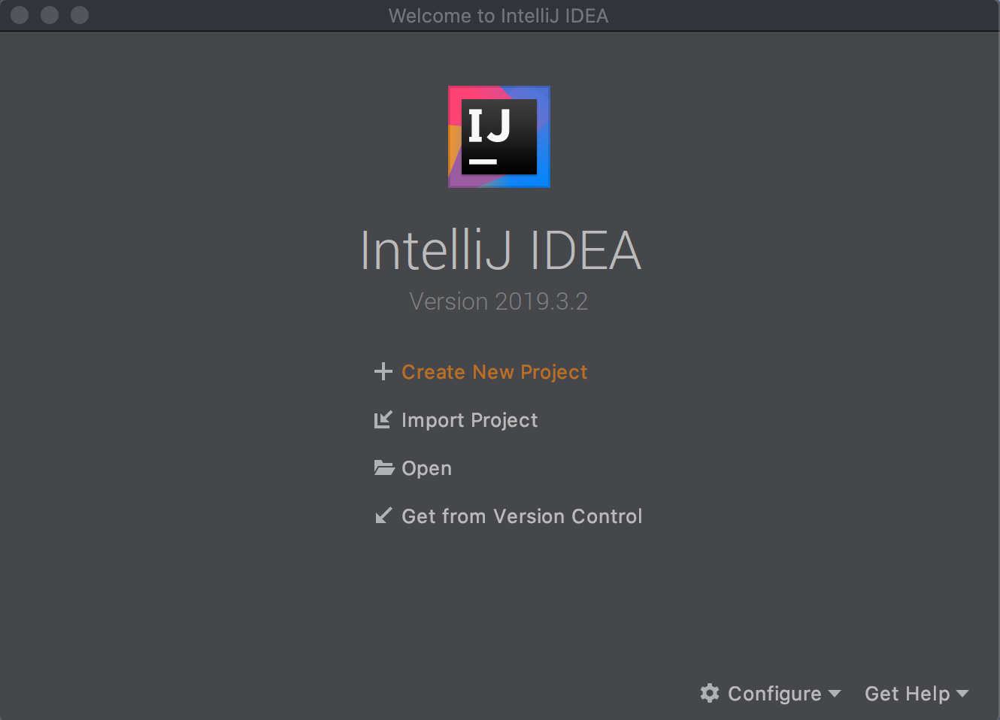
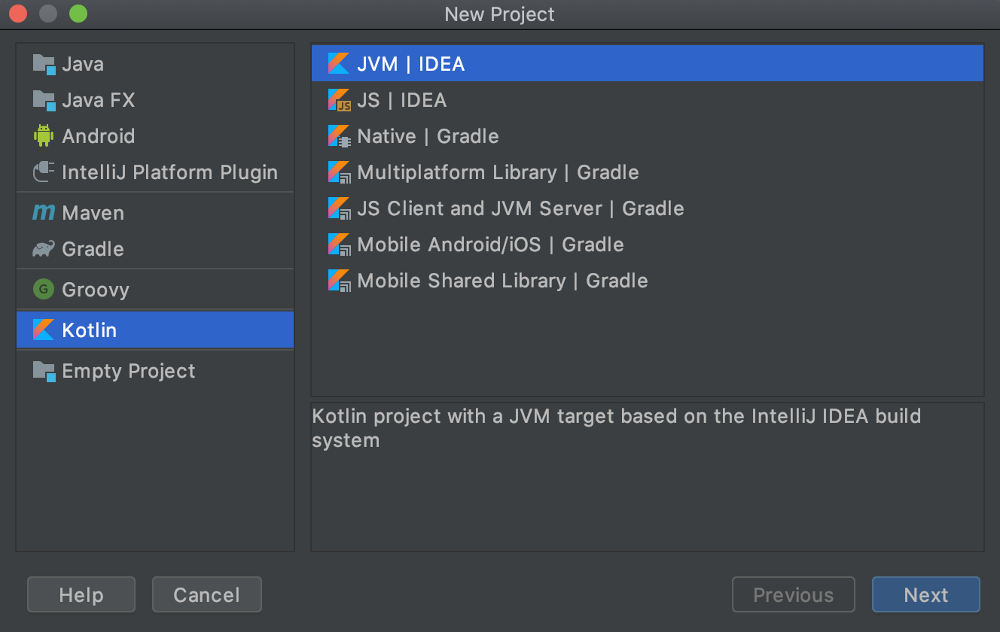
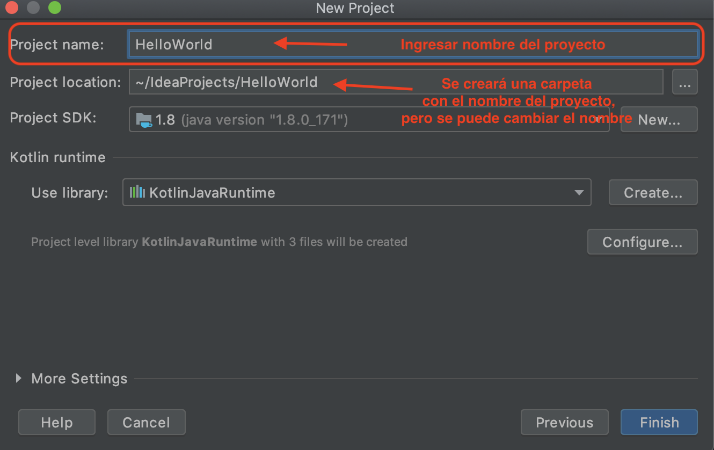
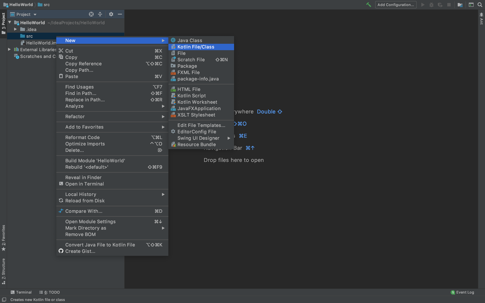
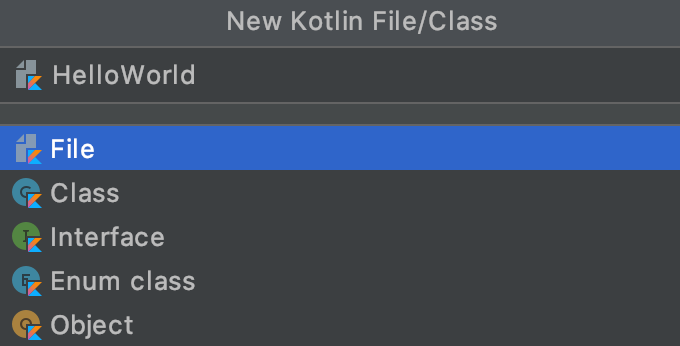
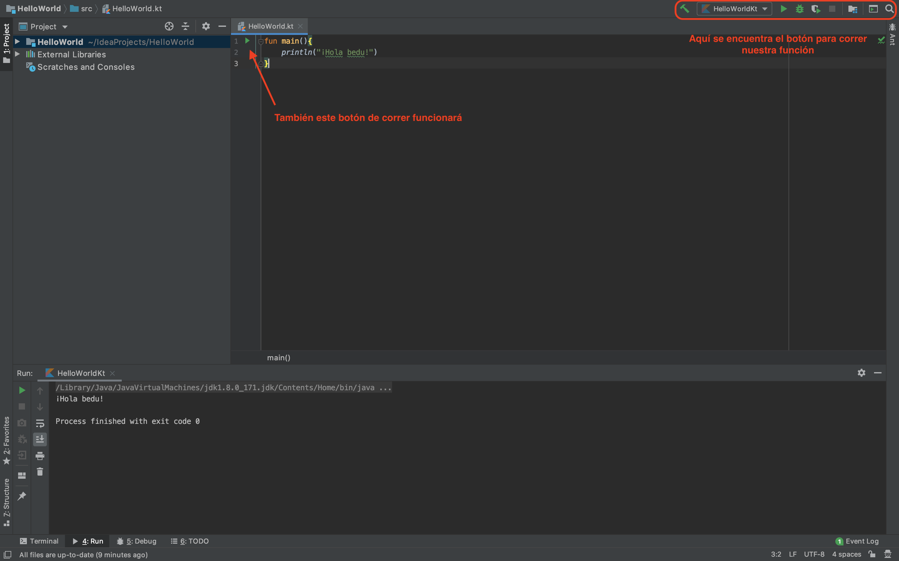
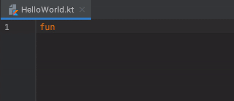

## Primeros pasos - IntelliJ IDEA y hola mundo

### OBJETIVO

- Instalar y configurar la IDE
- Utilizar las herramientas básicas que nos proporciona el entorno de desarrollo
- Crear nuestro primer programa con Kotlin!

#### REQUISITOS

1. Tener suficiente espacio en la memoria para instalar nuestro entorno de trabajo

#### DESARROLLO

##### Instalación de la IDE

Se pueden saltar este paso si lo hicieron previamente siguiendo las instrucciones del prework. Vamos a descargar nuestro entorno de trabajo visitando el sitio web oficial de JetBrains en la sección para descargar el archivo de instalación dependiendo el Sistema Operativo que utilicemos, [click aquí para visitar la página de descarga](https://www.jetbrains.com/idea/download)


Una vez descargado el archivo, ejecutar e instalarlo para poder crear nuestro primer proyecto.


##### Nuestro primer proyecto

Vamos a crear un nuevo proyecto de kotlin, para esto vamos a ejecutar los siguientes pasos: 

1. Abrimos nuestra aplicación **IntelliJ IDEA**, lo cual provocará que se abra la siguiente ventana:



2. Damos click en *crear nuevo proyecto*

3. Aparecerán unas opciones para configurar el tipo de proyecto, seleccionaremos ***Kotlin*** -> ***JVM | IDEA*** 



4. Se abrirá la siguiente pantalla, escribir el nombre del proyecto (nosotros lo nombramos *HelloWorld*)



5. ¡Todo listo! estaremos ahora en la pantalla del proyecto, ahora hay que crear nuestro archivo kotlin en donde haremos nuestra primera línea de código. Expandiremoss la carpeta que tiene el nombre de nuestro proyecto, daremos click derecho en la carpeta **src** y daremos click en ***New*** -> ***Kotlin File/Class*** , tal como se muestra en la imagen.



6. Aparecerá el siguiente recuadro, aquí es donde nombraremos el nombre de nuestro archivo, al que en este caso nombraremos *HelloWorld*



7. creamos nuestra primera línea de código en kotlin, que imprimirá el famoso **Hola mundo** , modificado por cierto :wink: 
el código es el siguiente: 

```kotlin
fun main(){
    print("¡Hola bedu!")
}
```
Para correr el código, daremos al botón play verde que se genera del lado izquierdo o en la parte superior de nuestra IDE, la imagen también muestra en la parte inferior la pestaña de run habilitada, que mostrará el mensaje que mandamos a imprimir a la consola



la ejecución del código debe verse de la siguiente forma:



