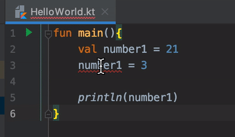
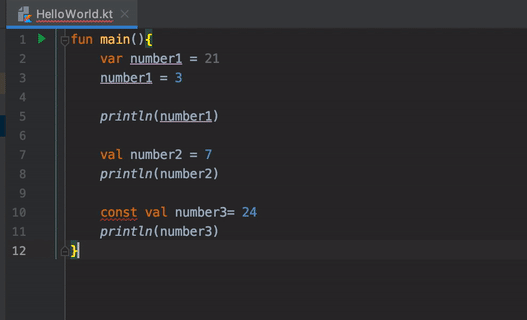

## Declaración de variables

### OBJETIVO

- Definir qué es una variable 
- Declarar implícitamente y explícitamente variables 

#### REQUISITOS

1. Tener una breve idea de qué representa una variable

#### DESARROLLO

##### Variables

Una variable es un espacio en memoria para guardar un dato, por medio de una dirección accedemos para leer o modificarla. En Kotlin las 
variables son tratadas como objetos, es decir, podemos llamar métodos desde una variable (este tema se abordará después).

existen tres tipos de variables:

* **var:** variables que pueden cambiar su valor (mutables)
* **val:** variables que no pueden modificar su valor (inmutables), la asignación puede suceder en *runtime*
* **const:** tampoco se puede modificar su valor, pero la asignación de su valor se determina en *compile time* o tiempo de compilación

haremos el siguiente ejercicio, abriendo un nuevo proyecto como en el [Ejemplo 1](../Ejemplo-01) y creando un archivo main con el siguiente código:

```kotlin
fun main(){
    val number1 = 21
    number1 = 3

    println(number1)
}
```

ahora este código lo corremos ¿Qué sucedió? en la consola debe salir un error similar a este: 

>Error:(3, 5) Kotlin: Val cannot be reassigned

Como dice el error, val sólo puede ser asignada una vez. Por eso reproduciremos lo que indica el gif: 



vemos que la variable se volvió var, para poder ser reasignada


corriendo el código: 

> 1


Ahora se correremos abajo: 

```kotlin
val number2 = 7
println(number2)
```

y corremos el código, la salida debe ser así: 

>3

>7


Ahora probaremos con el uso de const, crearemos la variable, la imprimimos y la corremos:

```kotlin
const val number3= 24
println(number3)
```

¿Qué sucede? desde el editor podemos ver que existe un error por la línea roja que aparece sobre const val, acercando el cursor a la línea 
aparece el error detectado, si apretamos *option + enter* o *ctrl + enter* para windows poniendo el cursos sobre la línea, saldrá un menú
mostrando opciones de corrección, pero la única opción es borrar el modificador const.



¿Por qué sucede esto? la diferencia es que const está pensado para declarar variables de forma global, mientras que val de manera local porque const se declara en tiempo de compilación.

por lo tanto, sacaremos nuestra constante de nuestra función :

```kotlin
const val number3 = 24

fun main(){
...

println(number3)
}
```

mostrando en consola: 

>3

>7

>24
