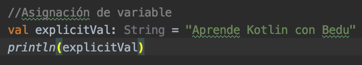

# Ej. 03 - Tipos de datos

## OBJETIVO

- Abstraer los conceptos de cada tipo de dato para interpretar sus aplicaciones.
- Usar los diferentes tipos de datos disponibles en kotlin.

## REQUISITOS

1. Tener alguna idea de los tipos de datos básicos en un lenguaje de programación.

## DESARROLLO


### Declaración implícita
La asignación de tipo de dato en la variable es automática dependiendo del dato. Vamos a imprimir el tipo de dato de cada valor implícito

```kotlin
    val implicitVal = "Esta es una string implícita" //debe ser String
    println(implicitVal.javaClass.kotlin)

    val implicitNumber = 13 //debe ser Int
    println(implicitNumber.javaClass.kotlin)

```
en consola nos mostrará el tipo que se le asignó:

> class kotlin.String

> class kotlin.Int


### Declaración explícita
Permite conocer el tipo de dato que va a almacenar la variable, sirve para fijar una variable con una base de tipo en una clase y lanzar un error al asignar mal un tipo de dato. 

```kotlin
val explicitVal: Int = "Aprende Kotlin con Bedu"
println(explicitVal.javaClass.kotlin)
```

nos va a marcar el siguiente error

marca un error, al abrir la ventana de ayuda nos sugiere cambiar el tipo a *String*, aceptamos y nos queda así:

```kotlin
val explicitVal: String = "Aprende Kotlin con Bedu"
println(explicitVal.javaClass.kotlin)
```

nos percatamos de que el tipo de variable *String* está en gris porque la declaración explícita en este caso es redundante (por fines demostrativos). 



Nuestro resultado es el siguiente: 

> class kotlin.String


### Clasificación de tipos

Existen varios tipos de datos básicos que nos faciclita la SDK de kotlin, pero vamos a utilizar los siguientes:


#### Números

Representan números con diferentes rangos, se subclasifican por enteros y decimales.

- **Enteros:**

  Tipo | Tamaño (bits) | Valor mínimo | Valor máximo
  -----|---------------|--------------|-------------
  Byte | 8 | -128 | 127
  Short | 16 | -32768 | 32767
  Int | 32 | -2,147,483,648 (-2^31) | 2,147,483,647 (2^31 - 1)
  Long | 64 | -9,223,372,036,854,775,808 (-2^63) | 9,223,372,036,854,775,807 (2^63 - 1)

- **Decimales:**

  Tipo | Tamaño (bits) | Bits para la base | bits para el exponente | dígitos decimales
  -----|---------------|-------------------|------------------------|-------------------
  Float | 32 | 24 | 8 | 6-7
  Double | 64 | 53 | 11 | 15-16


  ```kotlin
  // Números (Numbers)
      val byte: Byte = 127 // 8 bits
      val short: Short = 1234 // 16 bits
      val int: Int = 324 // 32 bits
      val long: Long = 1000000000000 // 64 bits
  ```

  Para declaración implicita, Kotlin infiere el tipo *Int* siempre y cuando el número dado no exceda el máximo valor permitido. También podemos declarar una variable a long con el caracter ***L*** en seguida del número.
  
  ```kotlin
      var long = 27L //Long
      println(long.javaClass.kotlin)
  ```
  
  >class kotlin.Long
 
- **Constantes literales**
 Se pueden escribir los números en su representación binaria y hexadecimal (no así en octal)
 
  ```kotlin
      val hexadecimal = 0x0F
      println(hexadecimal.javaClass.kotlin)
      val binary = 0b00001011
      println(binary.javaClass.kotlin)
  ```
  
  Por su salida vemos que los tipos siguen siendo *Int*
  
  > class kotlin.Int
  
  > class kotlin.Int
  
  Desde Kotlin 1.1, los números pueden ser separados con guiones bajos o *underscores* :

  ```kotlin
      val oneMillion = 1_000_000
      println(oneMillion)
  ```
  >1000000

### Caracteres

Se representan con el tipo *Char* y se declaran con comillas simpless ***'***

```kotlin
    val c = 'A'
    println(c.javaClass.kotlin)
    println(c)
```

nuestro tipo de variable debe ser Char

>class kotlin.Char

>A

### Booleanos

Representan un valor positivo o negativo representados por ***true*** y ***false*** 

```kotlin
    val trueVal = true
    val falseVal = false
    println(trueVal.javaClass.kotlin)
    println(trueVal)
    println(falseVal.javaClass.kotlin)
    println(falseVal)
```

esto nos arroja: 

>class kotlin.Boolean

>true

>class kotlin.Boolean

>false

### Strings 

También conocido como cadenas de texto, representados por el tipo *String*, podríamos decir que es una colección de caracteres. Se declaran con comillas dobles ***"***

```kotlin
val dialogue: String = "It's a secret to everybody"
println(dialogue)
```
Las raw Strings permiten escribir textos planos en párrafo, sin necesidad de usar escapes, se definen con tres dobles comillas ***"""***

Vamos a divertirnos un poco ejemplificando esto con el logo de The legend of zelda
```kotlin
val logoZelda = """
                                       /@
                       __        __   /\/
                      /==\      /  \_/\/   
                    /======\    \/\__ \__
                  /==/\  /\==\    /\_|__ \
               /==/    ||    \=\ / / / /_/
             /=/    /\ || /\   \=\/ /     
          /===/   /   \||/   \   \===\
        /===/   /_________________ \===\
     /====/   / |                /  \====\
   /====/   /   |  _________    /  \   \===\    THE LEGEND OF 
   /==/   /     | /   /  \ / / /  __________\_____      ______       ___
  |===| /       |/   /____/ / /   \   _____ |\   /      \   _ \      \  \
   \==\             /\   / / /     | |  /= \| | |        | | \ \     / _ \
   \===\__    \    /  \ / / /   /  | | /===/  | |        | |  \ \   / / \ \
     \==\ \    \\ /____/   /_\ //  | |_____/| | |        | |   | | / /___\ \
     \===\ \   \\\\\\\/   /////// /|  _____ | | |        | |   | | |  ___  |
       \==\/     \\\\/ / //////   \| |/==/ \| | |        | |   | | | /   \ |
       \==\     _ \\/ / /////    _ | |==/     | |        | |  / /  | |   | |
         \==\  / \ / / ///      /|\| |_____/| | |_____/| | |_/ /   | |   | |
         \==\ /   / / /________/ |/_________|/_________|/_____/   /___\ /___\
           \==\  /               | /==/
           \=\  /________________|/=/    
             \==\     _____     /==/ 
            / \===\   \   /   /===/
           / / /\===\  \_/  /===/
          / / /   \====\ /====/
         / / /      \===|===/
         |/_/         \===/
                        =  
"""
println(logoZelda)
```

No hace falta mostrar lo que se imprime en pantalla.

Por último, los **String templates** nos dan la posibilidad de incluir variables y expresiones dentro de una String. Esto se hace usando el símbolo de pesos $ y enseguida el nombre de la variable, o llaves para una expresión (que se escribiá dentro de ellas).

utilizando variables en un template: 

```kotlin 
    val edad: Int = 27
    println("Mi edad es $edad")
```


utilizando expresiones en un template: 

```kotlin
    println("En dos años tendré ${edad+2} años")
```

Se mostrará esto en consola

>Mi edad es 27

>En dos años tendré 29 años


</br>

[Siguiente](../Reto-03)
