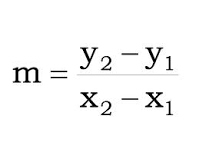

# Reto 03 - Operadores

## OBJETIVO 

- Hacer uso de los operadores 

## REQUISITOS 

1. Haber cursado el [Ejemplo 4](../Ejemplo-04)

## DESARROLLO


La ecuación de la pendiente se obtiene por la siguiente expresión:



Expresarla ahora con operadores:

<details>

<summary>Solución</summary
	
```kotlin
val m=(y2-y1)/(x2-x1) 
```
	
</details>

Resolver el valor de la pendiente, tomanto en cuenta que 

P1(4,3), P2(-3,-2)


<details>

<summary>Solución</summary
	
El resultado esperado sería:

> m = (-2-3)/ (-3-4) = (-5)/(-7) = 5/7 = 0.714

El código es:
```kotlin
val y2 = -2
val y1 = 3
val x2 = -3
val x1 = 4

val m=(y2-y1)/(x2-x1)
println(m)
```


el resultado obtenido es

>0

</details>


Del ejercicio anterior, responder: ¿Por qué el resultado obtenido difiere del resultado esperado?

<details>

<summary>Solución</summary>
	
Por que la operación de Integers dan un como resultado otro Int, como el resultado es decimal, se redondea a 0.
	
</details>

Encontrar una solución para que se refleje el resultado


<details>

<summary>Solución</summary>
	
Una solución es declarar alguno de nuestras variables como flotante, por ejemplo:

```kotlin
val y2 = -2f
```
Al detectar un Float, el resultado se vuelve flotante.

>0.71428573
	
</details>


</br>

[Siguiente](../Ejemplo-04)