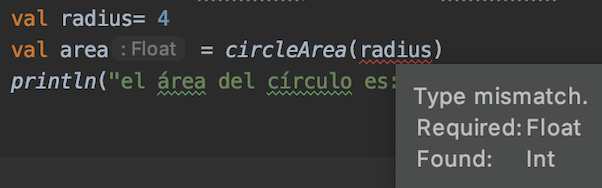
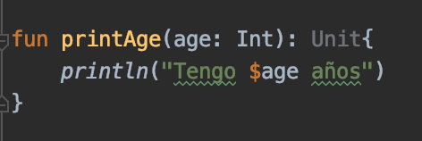

# Ej. 01 - Funciones

## OBJETIVO

- Implementar funciones a nuestro código para modularizarlo

## REQUISITOS

1. Tener una noción del concepto de función en programación

## DESARROLLO

### General

En esta serie de ejercicios aprenderemos a definir y crear funciones en kotlin.

Una función es una serie de instruccicones en un módulo para lograr un objetivo específico.

La estructura es  la siguiente: 

```kotlin
fun nombre([Argumentos: tipo de dato]): [Tipo de dato retornado] {
...
[código a ejecutar]

return [variable con tipo de dato]
}
```

cabe destacar que en los ejercicios anteriores (y en los que haremos después), el código que ejecutabamos venía dentro de una función llamada *main*

```kotlin
const val PI = 3.1416f
const val PHI = 1.618f
fun main(){ // en versiones de kotlin anteriores a la 1.3, la función recibe el valor args: Array<String> como parámetro

}
```

*println()* es una función provista por el SDK de kotlin

Vamos a crear una función que calcule el área de un círculo, para esto definiremos el número pi como constante y crearemos una función.

```kotlin
import kotlin.math.pow
...
fun circleArea(radius:Float): Float{  
    return PI*radius.pow(2)
}
```
pow es una **función** que vive en la clase float (o en otros tipos numéroicos) y eleva un número a cierta potencia (en este caso al cuadrado).

Ahora vamos a sacar el área de un círculo e imprimirlo en pantalla.

```kotlin 
fun main(){
    val radius= 4
    val area = circleArea(radius)
    println("el área del círculo es: $area")	
}
```

¿Qué sucede? El error reflejado nos indica que el tipo del parámetro esperado es un *Float* y estamos ingresando un *Int*


*En la imagen podemos observar que el orden en las funciones no importa*

Por lo tanto, debemos convertir nuestro valor *radius* en flotante.

```kotlin
val radius = 4f
```

corremos el código y nos devuelve lo siguiente:

> el área del círculo es: 50.2656


Unit es el tipo de dato que se declara en una función en kotlin para avisar que no se devuelve un dato, pero no es necesario especificarlo.

```kotlin
fun printName(name: String){
    println("Mi nombre es $name")
}

fun printAge(age: Double): Unit{
    println("Tengo $age años")
}
```

En el editor de idea, veremos el tipo de dato *Unit* en gris porque la declaración es redundante.



implementamos en *main* las dos funciones creadas para imprimir en pantalla:

```kotlin
    printName("Daniel Coutiño")
    printAge(15)
```

**Nota:** a pesar de que la función *printAge* recibe la edad como entero, el *String template* hace la conversión del entero a String.

Ahora utilizaremos una función que no requiera ningún parámetro de entrada, regresaremos el valor de PI de la variable constante ya definida

```kotlin
fun getPi(): Float{
    return PI
}
```

y la implementamos en *main()*

```kotlin
println(getPi())
```

Finalmente vamos a declarar una función que no reciba ningún parámetro y que no devuelva ningún valor:

```kotlin
fun printPhi(){
    println("El número áureo vale $PHI")
}
```

y la implementamos en nuestra función *main()* :

```kotlin
printPhi()
```
El resultado debe ser: 

> El número áureo vale 1.618

</br>

### Local functions (Funciones locales)

Una función local es básicamente una función dentro de otra. Tiene las siguientes características

- Es una función únicamente al alcance de la función que la contiene

- se declara como una función normal

- Mantiene limpio el código al ayudar mejor a establecer las jerarquías y conexiones entre funciones.

- Agrega reusabilidad al código.


Sabiendo funciones locales se declaran de la misma forma que las normales,  vamos a crear una función login que valide usuario y contraseña. Dicha función se llamará validate y recibirá nuestro parámetro a evaluar (para este caso, si la variable no está vacía).

```kotlin
//Funciones locales
fun login(user: String, password: String) : Boolean {
    fun validate(input: String): Boolean{
        if (input.isEmpty()) {
            return false
        }
        return true
    }
    val userValidated = validate(user)
    val passValidated = validate(password)

    return userValidated && passValidated
}
```

En la función anterior, primero declaramos la función validate y después validamos usuario y contraseña. Devolvemos las banderas de modo
que las dos deben estar correctas para recibir un login exitoso.

Después, hay qué correr la función como sigue"

```kotlin
val userValidated = login("Juanito","Navaja") //utilizar la función login y guardar el resultado en una variable.
println("Usuario loggeado? $userValidated") // Imprimir si el usuario están ingicado.
```

</br>

### Default Arguments y Named Arguments

Los ejemplos anteriormente vistos pasan sus parámetros en orden, de la misma forma en la que se declaran en la creación de la función, de modo que si tuviéramos dos parámetros de distintos tipos e invirtiéramos el orden de estos al momento de llamar la función, nos daría un error porque los tipos de datos no coincidirían con los de la definición. De la misma forma, si el número de parámetros ingresados en la llamada de la función son distintos al de la declaración, marcará otro error. Crearemos una función para el área de un rectángulo:

```kotlin
fun rectangleArea(base:Double ,  height: Double ):Double{
    return base*height
}
```

llamamos la función sin pasar argumentos:

```kotlin
println("Area con valores por defecto: ${rectangleArea()}")
```

El resultado obtenido es:

> <p style="color=red">Error:(..,..) Kotlin: No value passed for parameter 'base'</p>

Como siempre debemos tener un valor para esos parámetros, existe una forma de establecer valores por defecto en caso de la ausencia de uno o más parámetros:

```kotlin
fun rectangleArea(base:Double = 20.0,  height: Double = 30.0):Double{
    return base*height
}
```

Determinamos entonces base con valor 20 y altura como 30 en caso de no pasarlos como parámetro. Hacemos dos pruebas; la primera sin argumentos, y la segunda solo con la base:

```kotlin
//correr area rectangulo con los valores por defecto
println("Area con valores por defecto: ${rectangleArea()}")

//Area de rectangulo con base seteada y altura por defecto
println("Area con altura por defecto: ${rectangleArea(10.0)}")
```

para el primer ejemplo, se ocupan los valores por defecto 20x30 = 600. Para el segundo, la base es 10 y la altura es por defecto, o sea 10x30 = 300.

Tenemos ahora un problema, si queremos poner únicamente la altura, no podemos hacerlo debido a que el orden de los argumentos nos obliga a poner primero la b ase para determinar la altura. Afortunadamente, los named arguments permiten pasar argumentos a funciones por medio de su nombre y prescindiendo del orden en que se declaran. Entonces, si queremos asignar únicamente altura, solo tenemos qué poner el nombre y su valor dentro de los paréntesis:

```kotlin
//Area de rectangulo con por defecto y altura seteada con named arguments
println("Area con base por defecto: ${rectangleArea(height = 10.0)}")
```
    
En este caso, la base vale 20 y la altura 10, por lo tanto 20x10 = 200.

Podemos determinar los dos parámetros con argumentos nombrados (named arguments) sin ningún problema y en el orden que sea:

```kotlin
//setear base y altura con named arguments
println("Area con datos determinados con named arguments: ${rectangleArea(height = 2.0,base=3.5)}")
```

En este caso, el valor arrojado es de 2x3.5 = 7. 

Puedes intentar cambiar el orden para verificar que esto no afecta al resultado de la función.


</br>

[Siguiente](../Reto-01)


