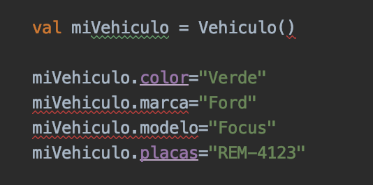

# Ej. 02 - Constructores

## OBJETIVO

- Implementar constructores en nuestras clases para definir variables esenciales

## REQUISITOS

- Saber crear una clase, generar un objeto, asignar valores y llama métodos

## DESARROLLO

Un constructor es un método que define los atributos mínimos requeridos para crear un objeto.

En el [Reto 1](../Reto-01) definimos atributos con Strings vacías

```kotlin
class Vehiculo {
    var color= ""
    var marca = ""
    var modelo = ""
    var placas = ""
    ...
```
El problema aquí es que un vehículo requiere tener al menos la marca, el modelo y el color definidos desde su creación porque son indispensables en su definición.

Recreamos entonces esta clase para que estas tres variables queden definidas desde su creación, dentro del **Constructor primario**:

```kotlin
class Vehiculo constructor(val marca:String, val modelo: String, var color: String) {
    var placas = ""
    var gasolina = 0f
    var encendido = false
}
```

Como marca y modelo no cambian, usaremos val; el color puedes ser cambiado, por eso es var. Esto debido a que el keyword *val* implica que la variable se le asigna el valor una sola vez y es inmutable (no cambia su valor), mientras que *var* permite modificar indefinidamente su valor (mutable).

Como la clase Vehiculo no tiene ninguna anotación o modificadores de visibilidad, podemos omitir el keyword *constructor*

```kotlin
class Vehiculo(val marca:String, val modelo: String, var color: String){
...
}
```

El constructor sólo define atributos, por lo tanto si se quiere ejecutar código durante su construccción, se debe definir un **initializer block** con el keyword ***init*** dentro de la clase:

```kotlin
class Vehiculo(val marca:String, val modelo: String, var color: String){

init{
    println("""Los datos del coche son:
        marca: $marca
        modelo: $modelo
        color: $color""")
}
...
}
```

Regresamos al *main* y nos encontramos con estos errores



Esto se debe a que el constructor ya no está vacío y porque modelo, marca y color ya son *val*. Agregamos los parámetros al constructor del objeto y eliminamos la asignación de color, marca y modelo_

```kotlin
...
val miVehiculo = Vehiculo("Ford","Focus","Verde")
...
```

Al correr, debe salir esto en consola: 

> Los datos del coche son:
>            marca: Ford
>            modelo: Focus
>            color: Verde


Ahora usaremos únicamente un **constructor secundario**: estos van adentro de la clase, pueden ejecutar código pero no pueden declarar atributos; debes declararlos en la clase y asignarle el valor en el constructor. Eliminamos init porque redundaría con el constructor secundario y volveríamos a declarar nuestras variables que se definían en el constructor, pero con el modificador ***lateinit***
 para poder definirlos después
.

```kotlin
class Vehiculo {

    constructor(marca:String, modelo: String, color: String){
        this.marca = marca
        this.modelo = modelo 
        this.color = color
        println("""Los datos del coche son:
            marca: ${this.marca}
            modelo: ${this.modelo}
            color: ${this.color}""")
        
    }
    
    lateinit var marca: String
    lateinit var modelo: String
    lateinit var color: String 
    var placas = ""
    var gasolina = 0f
    var encendido = false
    
    ...
```

si no se cambió ningún valor en la construcccion de nuestro vehículo, nos debe arrojar el mismo resultado que el anterior.

La primera utilidad del constructor secundario es reemplazar al primario, pero como es redundante y no tan legible, regresaresmos el método primario y utilizaremos al secundario como una extensión del constructor:

```kotlin
class Vehiculo (val marca:String, val modelo: String, var color: String) {

    init{
        println("""Los datos del coche son:
            marca: $marca
            modelo: $modelo
            color: $color""")
    }

    constructor(marca:String, modelo: String, color: String, placas: String): this(marca,modelo,color){
        this.placas = placas
        println("las placas son: ${this.placas}")
    }


    var placas = ""
    var gasolina = 0f
    var encendido = false
}
```

En este caso, el secundario da como una opción la de poder ingresar la placa en el constructor, pero no sustituye al primario. CUando el constructor primario existe, debemos regresar como tipo, this(parametros del constructor). Ahora en *Main*, agregamos la placa.

```kotlin
val miVehiculo = Vehiculo("Ford","Focus","Verde", "REM-4123")
```

la salida es: 

> Los datos del coche son:
>             marca: Ford
>             modelo: Focus
>             color: Verde
> las placas son: REM-4123


si se omite las placas en el constructor, no se ejecutará el constructor secundario.

El constructor es una función, por lo tanto tiene sus características, algunas vistas en [Este Ejemplo](../../Sesion-02/Ejemplo-01), por lo cual podríamos determinar en nuestra clase valores por defecto y usar named arguments. Vamos a poner el color negro por defecto

```kotlin
class Vehiculo (val marca:String, val modelo: String, var color: String = "Negro") {
...
```

y creamos un volkswagen gol para corroborar que funciona

```kotlin
val golNegro = Vehiculo("Volkswage","Gol")
```

Al observar el resultado, se imprime que el color es negro.

Ahora utilizaremos named arguments, crearemos un pointer azul:

```kotlin
val pointer = Vehiculo(
    color = "azul",
    marca = "Volkswagen",
    modelo = "Pointer"
)
```

el resultado debe ser impreso sin ningún detalle.


</br>

[Siguiente](../Reto-02)
