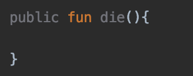
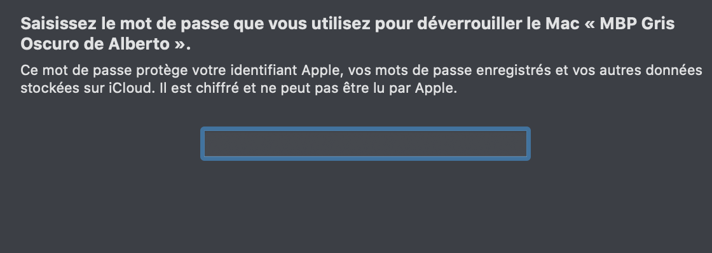

# Ej. 03 - Getters, Setters y modificadores de acceso

## OBJETIVO

- Personalizar comportamiento al asignar u obtener atributos de una clase
- Utilizar modificadores de accceso para restringir los atributos de la clase

## REQUISITOS

1. Haber cursado los temas anteriores en este módulo

## DESARROLLO

### Modificadores de acceso (Visibility modifiers)

Cuando hablamos de atributos en una clase, caeremos en cuenta de que algunas requieren algún mayor nivel de seguridad que otras. Por lo tanto, en kotlin como en la mayoría de los lenguajes de programación existen los modificadores de acceso, que determinan desde dónde podemos acceder a nuestras variables y métodos. Kotlin cuenta con los siguientes modificadores de acceso:

* **private:** Que es accesible solo dentro de la clase que lo contiene.
* **protected:** Sólo se tiene accceso dentro de la clase y por medio de las clases que heredan de este.
* **internal:** Accesible entre módulos (una serie de archivos compilados en conjunto).
* **public:** Como su nombre lo indica, da acceso a toda entidad que desee llamarlo.
    
Cabe señalar que los modificadores no se limitan a Programación orientada objetos, sino que aplican a archivos, funciones, variables, etc. Sin embargo, es un tema que va de la mano con POO.

Public es el modificador por defecto, eso hace que declararlo sea redundante. Hemos visto  previamente el uso de valores públicos en el  [Reto 1](../Reto-01), cuando consultamos desde *main.kt* el estado del coche. 

```kotlin
println("El coche está prendido? ${miVehiculo.encendido}")
miVehiculo.encender()
println("El coche está prendido? ${miVehiculo.encendido}")
```

Podemos acceder sin ningún problema al atributo. 

Ahora imaginemos un ejemplo de uso para *private*. En *Super Mario Bros*, Mario tiene diferentes efectos cuando colisiona con un *Super Mushroom*, con un *goomba*, con una *Fire Flower* .

| Objeto a colisionar |    Efecto    |
| ------------------- | ------------ |
|   Super Mushroom    |  Super Mario |
|   Fire Flower       |  Fire Mario  |
|       Goomba        |  Quitar vida |


Definiremos dos atributos: 

* **state:** definirá el estado de mario (mario pequeño, super mario, mario fuego)
* **lives:** la cantidad de vidas

estos atributos deben ser privados, de lo contrario cualquiera podrá ponerse vidas infinitas y volverse fire Mario.

crearemos un método para restar una vida cuando mueres, y tampoco puede ser manipulado por otra entidad porque  uno no controla la muerte directamente, sino los eventos que lo provocan, por eso debe ser también privado.

**Nota:** Si *die()* debiera ser pública, y queremos especificar su tipo, la IDE nos va a marcar que la declaración del modificador es redundante: 



Por último, crearemos un colisionador para detectar que en cuanto toques un objeto, tenga el efecto de la tabla.

```kotlin
class Mario(var vidas: Int =3){ //vamos a dejar setear el número de vidas al iniciar el objeto Mario

    init {
        println("It's a me! Mario!") //vamos a hacer que Mario se presente al construirlo!
    }

    private var state = "small" //mario es pequeño al iniciar el juego
    private var lives = 3 //uno empieza el juego con tres vidas

    //resta una vida al jugador
    private fun die(){
        lives--
        println("Has perdido una vida!")
    }

    //el modificador public es redundante
    //en función del objeto colisionante, se ejecuta un evento
    public fun collision(collisionObj: String){
        when(collisionObj){
            "Goomba" -> die()
                "Super Mushroom" -> state = "Super mario"
            "Fire flower" -> state = "Fire mario"
            else -> println("Objeto desconocido ¡no pasa nada!")

        }
    }
}
```

¡Muy bien! ahora vamos a instanciar nuestra clase en la función *main* y hacemos que mario colisione con un objeto no definido

```kotlin
import clases.Mario

fun main(){

    var mario = Mario()

    mario.collision("Pipe")

}
````

> Objeto desconocido ¡no pasa nada!


Ahora, agregamos otra colisión con un *Goomba*:

```kotlin
mario.collision("Goomba")
```

> Has perdido una vida!

### Getters y setters

Los atributos de una clase pueden ser leídos y escritos. Como mencionamos, el modificador *private* impide que fuera de la clase se pueda interactuar con un método o atributo, pero si un agente externo requiere poder sumar algún valor a un número sin tener acceso al valor actual o a modificarlo directamente, necesitamos usar un Setter. En el ejemplo anterior aislamos algunas de sus propiedades, pero, si están aisladas sus propiedades cómo accedemos a ellas, o cómo es que podemos modificarlas. Es ahí donde entran los *Getters* y *Setters*. En kotlin, podremos declarar Getters y Setters por dos formas: 

* Provistos por el programador
* desde kotlin

**Provistos por el programador**

En el ejemplo de Mario tenemos un ejemplo de un setter:

```kotlin
private fun die(){
    lives--
    println("Has perdido una vida!")
}
```

Con eso deducimos que un setter no sólo da acceso a una variable, sino que restringe la forma en la que se puede modificar y cualquier otro paso adicional (en este caso, imprimir el mensaje "Has perdido una vida").

si queremos saber el número de vidas necesitaremos crear un *Getter*:

```kotlin
fun getLives(): String{
    return "$lives vidas"
}
```

En este caso, tampoco estamos devolviendo el número de vidas en sí, sino estamos regresando un String que especifica que son vidas la cantidad enviada. Este tipo de transformaciones pueden reducir código al ejecutar una tarea repetida en kotlin.

Utilizando el *Getter* después de tocar a un Goomba queda:

```kotlin
println("Te quedan ${mario.getLives()}")
```

> Te quedan 2 vidas

**Get y Set desde kotlin**

Todas las variables declaradas llevan implícitas un método *Get* y *Set*, y al ser leídas o escritas, estas se ejecutan. Esto sería equivalente a declarar:

```kotlin
private var state = "small" //mario es pequeño al iniciar el juego
set(value){
    field = value
}
get() = field
```

veremos una línea sobre el getter y setter que indican redundancia en el código, y es lógico porque son los valores por defecto de estos y no tienen por lo tanto qué ser declarados.




Utilizaremos la variable lives para crear un Setter desde Kotlin. Al parecer no existe restricción en que el número de vidas sea mínimo de una vida, y podríamos llevarlo a vidas negativas. Vamos a matar a mario 5 veces.

```kotlin
for(i in 1..5){ //matando a mario 5 veces
    mario.collision("Goomba")
    println("Te quedan ${mario.getLives()}")
}
```

ejecutamos ese código y tendremos este resultado:

> Has perdido una vida!

> Te quedan 2 vidas

> Has perdido una vida!

> Te quedan 1 vidas

> Has perdido una vida!

> Te quedan 0 vidas

> Has perdido una vida!

> Te quedan -1 vidas

> Has perdido una vida!

> Te quedan -2 vidas

Este código lógicamente no está bien, requerimos ponerle un alto cuando mario tenga ya sólo una vida, porque al llegar a cero, se pierde automáticamente. Para eso utilizaremos el método *set*:

```kotlin
set(value){
    if(field == 1){ //si teníamos una vida, se termina el juego
        field = 0
        gameOver()
    } else if(field==0){ //si ya teníamos 0 vidas, no haz reiniciado el juego
        println("Necesitas volver a jugar")
    }
    else{
        field=value //podemos asignar el valor correctamente
    }
}
```

```kotlin
private fun gameOver(){
    println("JUEGO TERMINADO")
}
```

La función *die()* ahora no es inutil, por lo tanto la eliminamos y al colisionar con un *Goomba*, pondremos directamente:

```kotlin
...
"Goomba" -> lives--
...
```

y reproducimos:

> It's a me! Mario!

> Te quedan 2 vidas

> Te quedan 1 vidas

> JUEGO TERMINADO

> Te quedan 0 vidas

> Necesitas volver a jugar

> Te quedan 0 vidas

> Necesitas volver a jugar

> Te quedan 0 vidas


</br>

[Siguiente](../Reto-03)


