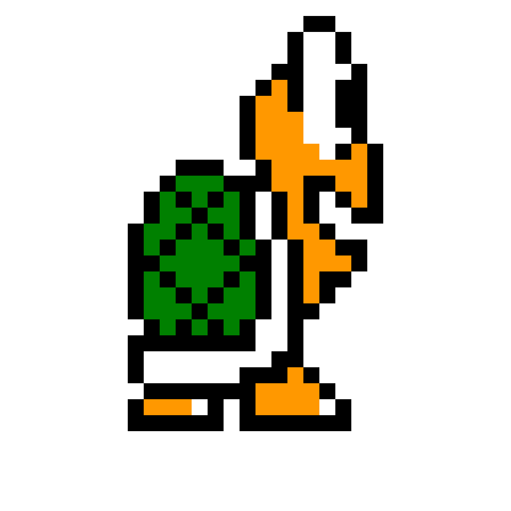
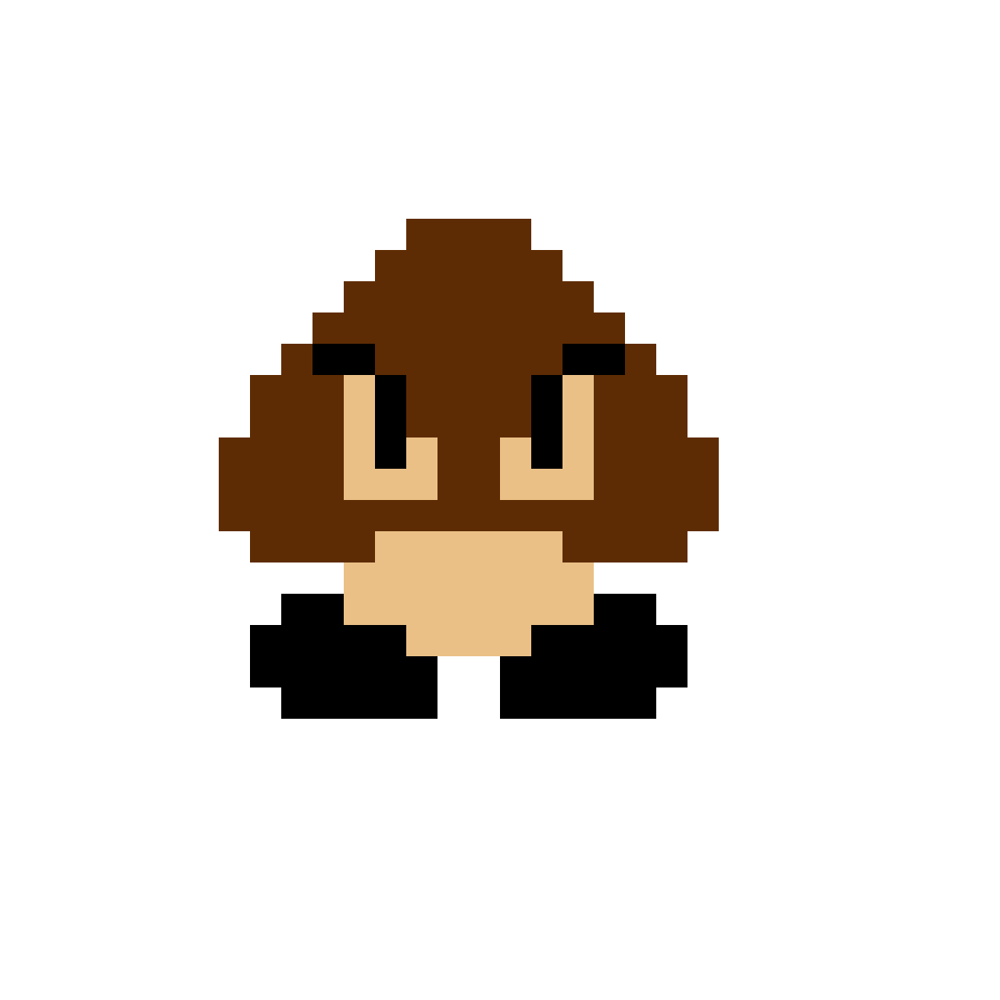
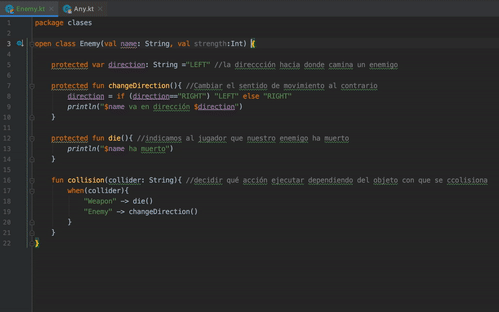
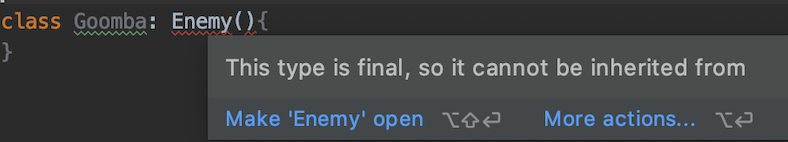
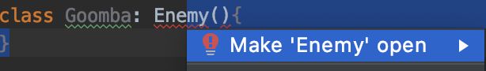
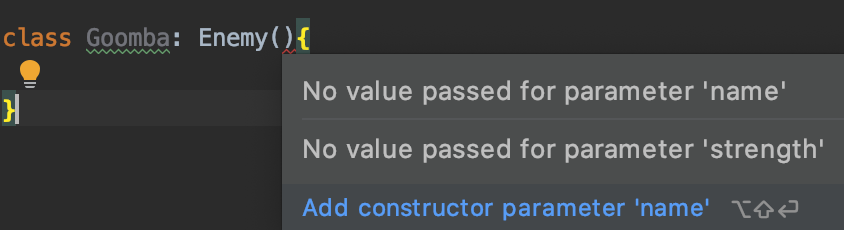
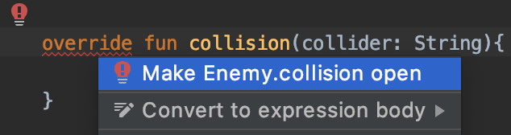

# Ej. 01 - Herencia y polimorfismo

## OBJETIVO

- Definir clases base que generalicen las propiedades y el comportamiento de una jerarquía
- Heredar y redefinir miembros de una clase padre.

## REQUISITOS

1. Leer el prework de esta sesión para formarse una idea de lo que implican estos conceptos.

## DESARROLLO

### Herencia

Esta es una propiedad de la Programación Orientada a Objetos que permite la creación de clases "hijo" o subclases a partir de una clase "padre" o superclase, esta superclase hereda los atributos y métodos que estén permitidos por encapsulamiento (dependiendo del modificador de acceso asignado a cada propiedad) a sus subclases. Pueden existir varias subclases de una superclase, pero no una subclase con varias superclases.

Vamos a crear una clase nueva que servirá de base para todos los enemigos de Mario. ¿Qué cosa tienen en común los enemigos de Mario?

* Colisionan con otras entidades
* Se mueren al colisionar con poderes
* Tienen un nombre
* Se mueven hacia una dirección y la cambian al colisionar con objetos o enemigos

Imaginemos que en Mario algunos enemigos te pueden matar incluso siendo grande o teniendo la flor de fuego, en este caso vamos a tener también un nivel de daño 1 y 2.

Vamos a abstraer todas estas características que enlistamos a un clase en kotlin: 

```kotlin 
class Enemy(val name: String,val strength:Int) {

    protected var direction: String ="LEFT" //la direccción hacia donde camina un enemigo

    protected fun changeDirection(){ //Cambiar el sentido de movimiento al contrario
        direction = if (direction=="RIGHT") "LEFT" else "RIGHT"
        println("$name va en dirección $direction")
    }

    protected fun die(){ //indicamos al jugador que nuestro enemigo ha muerto
        println("$name ha muerto")
    }

    fun collision(collider: String){ //decidir qué acción ejecutar dependiendo del objeto con que se ccolisiona
        when(collider){
            "Weapon" -> die()
            "Enemy" -> changeDirection()
        }
    }
}
```

y vamos a probar que la clase funciones como lo esperado, vamos a crear un enemigo y lo vamos a colisionar con un enemigo y luego con un poder *Weapon*

```kotlin
    val enemy = Enemy("Un enemigo",2)

    enemy.collision("Enemy") //al ser otro enemigo con el que se colisiona, se debe cambiar de dirección
    enemy.collision("Weapon") //al colisionar con un arma o poder, el enemigo debe morir
```

> Un enemigo va en dirección RIGHT
> Un enemigo ha muerto

El código respondió como se esperaba. Esta es una clase base para determinar a los enemigos de mario, para enumerar dos tenemos a los siguientes:

* Koopa: tortugas que al ser aplastadas, se vuelven caparazón. 
	
* Goomba: se mueren al ser aplastados. 


Todas las clases derivan de la superclase ***Any()***



Como vemos en el gif, esta nos hereda tres métodos: 


* ***equals(other: Any?)***: Revisa si el objeto es igual al parámetro de entrada
* ***hashCode()***. Devuelve un entero como hash (como identicador)
* ***toString()***: Regresa una cadena de texto con una representación textual del objeto.


Vamos a crear la clase ***Goomba***, que va a ser una subclase de *Enemy*. Para ello, definiremos la clase y su superclase como definimos variables con su tipo de dato.

```kotlin
class Goomba: Enemy(){
    
}
```

En este caso, nos saldrá un error en el tipo de dato, que revelará el siguiente conflicto:




Si damos click izquierdo sobre el error, y posteriormente pulas *option + enter*, saldrá una posible solución: 



Al dar click sobre esa función, veremos que a enemy se le asigna un modificador ***open***. Dicho modificador, otorga la facultad a una clase de poder heredar o de un método a ser sobreescrito.

```kotlin
open class Enemy(val name: String, val strength:Int) :Any(){
...
```

Regresando a nuestra clase *Goomba*, podremos notar que existe ahora otro error marcado entre los paréntesis de la superclase: 



Como podemos ver en la imagen, el error se debe a que nos faltan dos parámetros: *name* y *strength*, que son los parámetros iniciales del constructor de nuestra clase padre. Para corregir este error, debemos crear un constructor para *Goomba* que incluyan dichas variables y asignárselas al constructor de la superclase:

```kotlin
class Goomba(name: String, strength: Int): 
    Enemy(name,strength){
    
    init {
        println("iniciando subclase de $name")
    }
}
```

Agregamos ahora un *init{}* para la superclase:

```kotlin
open class Enemy(val name: String, val strength:Int) :Any(){

    init {
        println("iniciando superclase de $name")
    }
    ...
```

en la función *main()*, reemplazamos el inicializador *Enemy()* por *Goomba()*

```kotlin
...
val enemy = Goomba("Un enemigo",2)
...
```

y corremos:

> iniciando superclase de Un enemigo

> iniciando subclase de Un enemigo

> Un enemigo va en dirección RIGHT

> Un enemigo ha muerto

Con esto observamos que al construir un objeto derivado, se muestra que el inicializador que corre primero es el de la clase base, y después el del derivado. De la misma forma, todos los atributos y métodos que no son privados, son heredados a la clase hijo, por eso pudimos utilizar varios métodos sin necesidad de declararlos en la clase *Goomba*.

Como Goomba siempre tendrá el mismo nombre y la misma fuerza, no es necesario recibirlo como parámetro; lo podemos definir desde su constructor: 

```kotlin
class Goomba:
    Enemy("Goomba",1){

    init {
        println("iniciando subclase de $name")
    }
}
```

Ahora crearemos la clase *Koopa*:

```kotlin
class Koopa:
    Enemy("Koopa",2){
    
}
```

##### Polimorfismo

El polimorfismo normalmente es un concepto que va de la mano con **Herencia**, su nombre proviene del griego y significa "Muchas formas". Esta propiedad se refiere a la capacidad que tiene un método de tomar diversas formas y de modificar su funcionalidad en tipos particulares. Existen varias formas de expresar esta propiedad, por ejemplo:


* Métodos con el mismo nombre, pero diferente funcionalidad.
* Métodos con el mismo nombre, pero se distinguen por recibir parámetros diferentes.
* Métodos que pueden omitir parámetros 

Nos enfocaremos en la sobreescritura o **override**, que se da cuando una clase hereda y redefine características de otra.

En nuestro ejemplo, la clase koopa tiene dos estados: Caminando y Conch. Cuando Mario salta sobre la tortuga, esta deja de caminar y se guarda en la concha, pudiendo ser pateada. Este comportamiento modifica la forma en como colisiona mario con un enemigo, puesto que normalmente mueren. Para modificar este aspecto, vamos a sobreescribir el método *collision()*

```kotlin
override fun collision(collider: String){

}
```

Se mostrará un error con la siguiente solución:



Esto se debe a que la función *collision* no está declarada con el modificador ***open***, si damos click a la sugerencia de la IDE, se agregará dicho modificador al método *collision* en la clase *Enemy* 
```kotlin
open fun collision(collider: String){ 
...
}
```

en la función *main()*, creamos un nuevo koopa y lo colisionamos con un Weapon

```kotlin
val koopa = Koopa()
koopa.collision("Weapon")
```

pero al correr el código, no sucede nada ¿Por qué? al sobreescribir el método *collision*, dejamos vacía la función, por tanto no estamos ejecutando ninguna accción. Si quisiéramos ejecutar el algoritmo de la superclase y complementarlo con código adicional, debemos usar *super* para llamar a la superclase y llamar a nuestro método, eso es lo que haremos, imprimiendo adicionalmente un mensaje:

```kotlin
override fun collision(collider: String){
    super.collision(collider)
    println("Usando la colisión de la clase Enemy")
}
```

al correr el código, debe imprimirse lo siguiente:

> Koopa ha muerto

> Usando la colisión de la clase Enemy

Como para Koopa este no es el caso, modificaremos totalmente el comportamiento para que cuando el colisionador sea *Weapon*, este se vuelva concha (hay que imprimir el cambio).

```kotlin
override fun collision(collider: String){
    when(collider){
        "Weapon" -> {
            state = "Shell"
            println("El estado es ahora $state")
        } 
        "Enemy" -> changeDirection()
    }
}
```

> El estado es ahora Shell


</br>

[Siguiente](../Reto-01)


