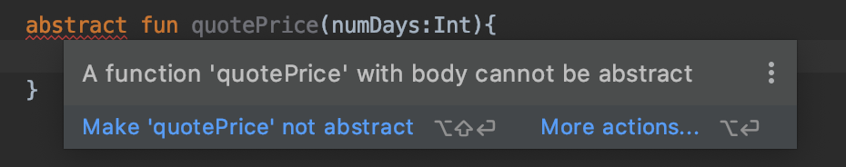
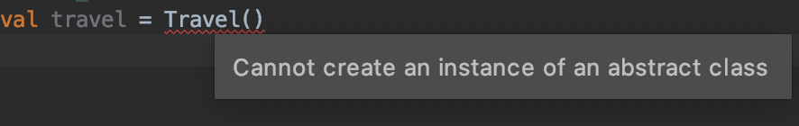
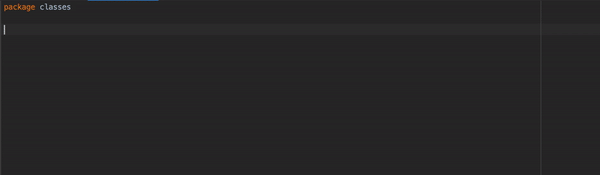

## Clases abstractas e interfaces

### OBJETIVO

- Programar una clase abstracta como unas base no instanciable de otras clases
- Sintetizar el significado de interfaces en kotlin y conocer los casos de uso
- Diferenciar entre estas dos por medio de la distinción de sus características y aplicaciones

#### REQUISITOS

1. Haber creado clases que hereden de otras.

#### DESARROLLO

##### Clases abstractas

Una abstracción es la separación, a nivel conceptual, de las propiedades de algo y definirlos a través del pensamiento, aislándolos del mundo sensible. Teniendo en cuenta esto, una clase abstracta permite crear una clase que su objetivo sea definitorio, por lo tanto, las clases abstractas no pueden ser instanciadas.

Dichas clases permiten crear métodos abstractos (que no tienen cuerpo) y métodos concretos (que tienen cuerpo). Cuando existe una jerarquía de clases que comparten un método, pero la forma de implementarla es totalmente distinta en todas las subclases, es innecesario que la clase padre defina la implementación.Las clases abstractas tienen las siguientes características:

- El único propósito de una clase abstracta es heredar a otras clases, por ende no puede ser instanciada.
- Toda clase que tenga un miembro abstracto, debe declararse abstracta.
- Un método abstracto no tiene cuerpo.
- Puede tener miembros declarados y otorgarle el nivel de visibilidad que sea.


 Como ejemplo, vamos a simular una aplicación para la reservación de viajes. Podemos reservar viajes a una ciudad específica por cierta cantidad de días y cotizar tu viaje. Por el momento sólo hay viajes nacionales, pero pronto existirá la posibilidad de hacer viajes internacionales, por tanto, deducimos que estos tipos de viajes tendrán cosas en común y por tanto tendrán una superclase en común; a esa clase la llamaremos ***Travel***.
 
 ```kotlin
 class Travel {

}
```

Deberemos decir a qué país y ciudad queremos ir, el tipo de servicio a brindar (porque en un futuro, también podremos reservar hoteles o experiencias en sitios turísticos),  podremos cotizar un viaje, consultar el precio internamente en la clase y hacer la reservación; por lo tanto, nuestra clase tendrá los siguientes miembros:

```kotlin
class Travel {

    protected val country: String
    protected val city: String
    protected val serviceType = "Viaje"
    protected var reserved = false
    protected var paidAmount = 0

   fun reserve(numDays: Int){
        if(reserved){
            println("""¡Ya reservaste tu viaje! 
                       País: $country
                       Ciudad: $city
                       Precio: $paidAmount""".trimMargin())
            return
        }
        val amount = getPrice(numDays)
        if(amount==0){
            return
        }
        reserved = true
        paidAmount = amount
        println("""¡Viaje reservado exitosamente! 
                       País: $country
                       Ciudad: $city
                       Precio: $paidAmount""".trimMargin())
    }
}
```

Todo bien, espera... aún no podemos implementar la cotización del viaje! esto se debe a que para viajes internacionales, cobraremos un impuesto por día, cosa que no haremos en los nacionales. Aquí observamos varias características de la clase **Travel**:

- Esta clase en sí, no será instanciada, pues su único propósito es plantear un modelo general para las clases que sí usaremos.
- Los métodos ***quotePrice()*** y ***getPrice()*** (el método para cotizar el precio y para obtener la cantidad, respectivamente), no puede ser definido porque será diferente en cada clase hija.
- los atributos ***city*** y ***country*** no tienen qué ser implementados en esta clase.

Con estas características se deduce que requerimos usar una clase abstracta! 

```kotlin
abstract class Travel {

    abstract val country: String
    
    ...

    abstract fun quotePrice(numDays:Int){
    }
}
```

Los métodos y atributos que plantéabamos no tenían que estar inicializados o implementados, por lo cual se definen como ***abstract***. 

Detectan algún error? en el método *quotePrice* existe un problema. Si obtenemos la ayuda de idea, nos motrará esto:



No podemos tener una clase abstracta con cuerpo, por lo cual se nos ofrecen dos soluciones:


Vamos a remover el cuerpo de la función, y nos quedamos con la pura definición. Haremos lo mismo en *getPrice()*

```kotlin
    ...
    abstract fun quotePrice(numDays:Int)

    //es protected para que sólo se pueda obtener el valor numérico desde la clase
    protected abstract fun getPrice(numDays: Int): Int 
    
    ...
```

Ahora, en nuestro *main()*, intentaremos instanciar nuestra clase *Travel* ¿Qué sucede? 



Como mencionábamos anteriormente, no podemos instanciar una clase abstracta.

Ahora vamos a crear una clase para representa el servicio de viajes nacionales, que heredará de la clase *Travel*.



En esta animación, vemos un error al declarar *National* como hijo de *Travel*, que es no implementar los miembros abstractos, por lo que podemos hacerlo automáticamente con la ayuda de la IDE o manualmente. Notaremos el modificador *override*, que en este caso, se emplea para implementar los miembros abstractos de una clase abstracta.

Ahora haremos algunos cambios en la clase. Este servicio cuenta con los siguientes destinos a México:

* Monterrey en $400 por día
* Guadalajara en $350 por día
* CDMX en $360 por día
* San cristóbal en $240 por día
* San Miguel de Allende $320 por día

Para hacer la cotización, calculamos la tarifa diaria por la cantidad de días de permanencia. El valor *country* no requiere ser solicitado, puesto que sabemos de entrada que es en México. Finalmente, recibiremos en el constructor el parámetro *city*.

el resultado es el siguiente: 

```kotlin
class National(override val city:String): Travel(){
    override val country = "Mexico"

    //este map es sun catálogo los diferentes precios por día dependiendo de la ciudad
    protected val fees = mapOf(
        "Monterrey" to 400,
        "Guadalajara" to 350,
        "CDMX" to 360,
        "San Cristóbal de las casas" to 240,
        "San Miguel de Allende" to 320
    )
    
    override fun getPrice(numDays: Int): Int {
        val fee = fees[city] //obtenemos la tarifa según la ciudad
        return if (fee==null) 0 else fee*numDays //regresamos 0 si no hay tarifa, si sí, hacemos el cálculo
    }

    override fun quotePrice(numDays: Int) {
        val price = getPrice(numDays)
        if(price==0){ //si no existe tarifa para esa ciudad, notificamos al usuario
            println("Lo sentimos, no hacemos viajes a esta ciudad")
        } else{
           println("Tu viaje a $city cuesta \$$price") //notificamos el precio al usuario
        }
    }
}
```
Como el caso de la ciudad, podemos inicializar cualquier atributo abstracto desde el constructor.

Hacemos la siguiente prueba en main, cotizando para dos días y reservando para 4:

```kotlin
val viajeMonterrey = National("Monterrey")
    viajeMonterrey.quotePrice(2)
    viajeMonterrey.reserve(4)
```

El resultado debe ser el siguiente:

Tu viaje a Monterrey cuesta $800
¡Viaje reservado exitosamente! 
                       País: Mexico
                       Ciudad: Monterrey
                       Precio: 1600

Ahora hacemos el mismo experimento para Monclova:

> Lo sentimos, no hacemos viajes a esta ciudad


##### Interfaces

Una interfaz podría parecer a simple vista una clase abstracta, ¡ pero no la es!

Las interfaces pueden contener atributos y métodos abstractos, pero en este caso, no hace falta utilizar el modificador **abstract**. A diferencia de Java, en Kotlin las interfaces pueden tener miembros declarados.

- No se puede instanciar una interfaz
- Se permiten abstracciones parciales (algunos miembros declarados y los otros únicamente definidos)
- Una clase puede implementar muchas interfaces, y pueden convivir con una clase que herede de otra
- Una interfaz puede implementarse en otra interfaz

Las interfaces se utilizan para asegurar se que una clase implemente los miembros requeridos normalmente para un tipo de característica en concreto.

Vamos a crear una interfaz que defina las características de algún servicio con promoción para fechas bajas que sólo pueden ser en vuelos nacionales.

```kotlin
interface IPromotion {
    val discount: Int //el descuento en porcentaje o en cantidad
    val typeDiscount: Int //porcentaje o cantidad

    fun getDiscountPrice(amount:Int): Int{ //obtener el precio real ya con el descuento
        return if(typeDiscount == 0) { //0 es porcentaje
            (amount * (100-discount))/100
        } else{ //cantidad específica
            amount - discount
        }
    } 
}
```
Ahora creamos una nueva clase que permita viajes nacionales en temporadas bajas:

```kotlin
class NationalLowSeason(city: String) : National(city),IPromotion {
    override  val discount = 10 //es porcentaje, o sea 10%
    override val typeDiscount = 0 //0 para porcentaje, 1 para cantidad

    override fun getPrice(numDays: Int): Int {
        val amount = super.getPrice(numDays)
        return if (amount == 0) 0 else getDiscountPrice(amount)
    }
}
```

Como vemos, una clase que implementa una interfaz puede convivir con la herencia de otra clase sea abstracta o concreta. La otra observación es que sobreescribimos la función **getPrice()** para poder devolver el precio con descuento, y utilizamos el método implementado en la interfaz.

Volvemos a hacer el viaje a monterrey por 4 días en temporada baja:

```kotlin
    val viajeBajaMonterrey = NationalLowSeason("Monterrey")
    viajeBajaMonterrey.reserve(4)
```

El resultado es el siguiente: 

> ¡Viaje reservado exitosamente! 
                       País: Mexico
                       Ciudad: Monterrey
                       Precio: 1440

Que es el precio con el descuento del 10% ($1440).

### Diferencias entre clases abstractas e interfaces

| Clases abstractas  | Interfaces |
| ------------- | ------------- |
| Una clase sólo puede heredar de una abstracta | puede implementársele múltiples a una clase  |
| puede heredar de una sola clase (abstracta o concreta)  | Puede implementar una sola interfaz |
| Se requiere el keyword ***abstract*** para definir un miembro abstracto |  el keyword es opcional pues ya viene por defecto |


