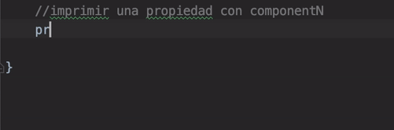

# Ej. 03 Data class y Companion object

## OBJETIVO

- Definir clases para mantener una estructura de datos
- Crear un miembro propio de una clase y no de un objeto

## REQUISITOS

1. Mantener datos en una clase
2. Requerir la inicialización de una variable constante 

## DESARROLLO

### Data class

Un Data class es una clase que tiene como único objetivo es cargar información en una clase a través de su constructor, sin poder definir métodos para modificar o eliminar sus datos.

Su definición y declaración sucede a través del constructor de la clase, pero con el modificador **data**.
```kotlin
data class Movie(
    val name: String,
    val gender: String,
    val duration: Double
)
```
Anteriormente declaramos una clase de datos de una película. Vamos a crear la primera clase de datos, que guardará datos de la película *Scary movie*.

```kotlin
//declaración
val scaryMovie = Movie("Scary movie", "Comedia", 88.27)
//impresión
println(scaryMovie)
```

la impresión de una data class se ve así:

> Movie(name=Scary movie, gender=Comedia, duration=88.27)

Si queremos obtener la propiedad de un objeto en pesona:

```kotlin
//imprimir una propiedad en específico
println(scaryMovie.name)
```

**Declaraciones en el cuerpo**

Se pueden definir propiedades en el cuerpo de la clase, pero serán excluidas de ciertas funcionalidades de kotlin que veremos enseguida.

```kotlin
data class Movie(
    val name: String,
    val gender: String,
    val duration: Double
){
    var createdAt=""
}
```

al volver a imprimir la clase como tal, esta variable es excluída de la impresión. Si dos objetos *Movie* tienen el mismo nombre,género y duración, pero diferente createdAt, seguirán siendo tratados como iguales.

Podemos reasignar el valor y leerlo.

```kotlin
scaryMovie.createdAt = "2000"
println("fecha de creación: ${scaryMovie.createdAt}")
```
Nos imprime lo siguiente

> Scary movie

> fecha de creación: 2000

**Declaraciones de desestructuración*** (Destructuring declarations)

Es una propiedad de Kotlin que permite extraer las propiedades de un objeto. Para esto, las funciones ***componentN()*** entran en juego.



En la animación se ve, con la ayuda del IDE, los *componentN()* generados, y fueron 3; por tanto, la variable declarada en el cuerpo fue excluída. Imprimiremos el *component2()*

```kotlin
println(scaryMovie.component2())
```
El resultado es

> Comedia

que corresponde al campo *gender*, o sea, el segundo parámetro en el constructor.

Estas funciones hacen posible la desestructuración de un objeto en sus variables:

```kotlin
//Desestructuración
val (name,gender,duration) = scaryMovie
println("la duración de la película es de $duration minutos")
```

el resultado de consola es: 

> la duración de la película es de 88.27 minutos

Si no requerimos el uso de la variable *name*, pero sí la de género y duration, utilizamos **_** para omitirlo.

```kotlin
val (_,gender,duration) = scaryMovie
```

si no necesitáramos duration, podríamos omitirlo de la declaracción puesto que no hay una variable después de ella que requiera ser llamada.

**Copiar un Data class**

La función ***Copy()*** se utiliza para generar una copia del objeto y asignarla a una variable. Se utiliza para cuando deseamos mutar  algunas de sus propiedades, pero mantener el original intacto. Vamos a crear la película scary movie 2 basándonos en la primera:

```kotlin
val scaryMovie2= scaryMovie.copy(name="Scary movie 2",duration=83.0)
println("""
    Scary movie: $scaryMovie
    Scary movie 2: $scaryMovie2
""".trimIndent())
```

El resultado es:

> Scary movie: Movie(name=Scary movie, gender=Comedia, duration=88.27)

> Scary movie 2: Movie(name=Scary movie 2, gender=Comedia, duration=83.0)

Toda variable declarada dentro del cuerpo de la clase, es excluída de la copia:

```kotlin
println("fecha de creación de ${scaryMovie2.name}: ${scaryMovie2.createdAt}")
```
> fecha de creación de Scary movie 2: 

Aunque Scary movie 1 ya tenía seteado su fecha, la 2 no copió dicho valor.


### Companion objects

En lenguajes de programación como java existe un modificador de acceso llamado static este modificador nos permite crear objetos, variables o métodos en una clase para utilizarlos sin necesidad de hacer una instancia de la clase. En kotlin, este modificador no existe, sin embargo, existe un tipo de objeto llamado ***companion object*** que cumple con dicha función. Sus características son las siguientes:

* Es un singleton, o sea, tenemos acceso a una sola instancia del objeto.
* No se pueden crear companion objects anidados
* Al heredar ode otra clase y crear una companion object sobre esta, el companion del padre queda obsoleto.


Ejemplo:

```kotlin
class Vehicle {

init{
    println("Vehículo creado")
}
    companion object Factory {
        fun create(): Vehicle = Vehicle()
    }
}
```

En el ejemplo podemos ver que nuestra clase vehicle tiene dentro un companion object que se encarga de crear instancias de la clase vehicle, los métodos de un companion object pueden llamarse haciendo referencia al nombre de la case sin paréntesis y con punto:

```kotlin
val vehicleInstance = Vehicle.create()
```

> Vehículo creado


</br>

[Siguiente](../Reto-final)