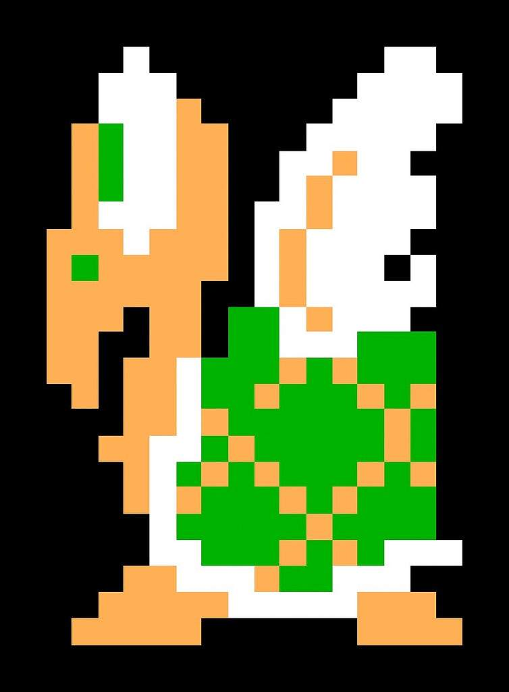

# Reto 01 - Herencia y polimorfismo

## OBJETIVO 

- Heredar de subclases
- reescribir métodos heredados

## REQUISITOS 

1. Haber terminado el [Ejemplo 1](Ejemplo-01) 

## DESARROLLO

Vamos a perfeccionar la clase Koopa

1. Imprimir el estado de Koopa cada que este cambie (borrar la impresión actual cuando colisiona con un Weapon)

    <details>
        <summary>Solución</summary>

    ```kotlin
    set(value) {
        field = value
        println("El estado es ahora $field")
    }
    ```

    </details>

    </br>

2. La primera vez que un Koopa colisiona con un Weapon, se vuelve shell: la segunda vez se muere. Reproducir este partón en la clase

    <details>
        <summary>Solución</summary>

    ```kotlin
    if(state=="Shell"){
        die()
    } else{
        state = "Shell"
    }
    ```

    </details>

</br>

3. Comprobar los ejercicios anteriores haciendo que un Koopa colisione dos veces con un Weapon.

    <details>
        <summary>Solución</summary>

    ```kotlin
    if(state=="Shell"){
        die()
    } else{
        state = "Shell"
    }
    ```

    en consola se debe reproducir lo siguiente:

    > El estado es ahora Shell

    > Koopa ha muerto

    </details>

    </br>

4. A partir de la clase Koopa, crear la clase de Koopas voladores (Koopa paratroopa). Su estado inicial es *Volando*, al colisionar por primera vez camina, a la segunda se vuelve concha y a la tercera muere. 


    <details>
        <summary>Solución</summary>

    Primero hay que volver a la clase Koopa *open* y volver la clase estado a *protected*
    ```kotlin
    open class Koopa:
    ...
    protected open var state = "Walking"
    ```

    Después creamos la clase que hereda de Koopa y reescribimos el colisionador, inicializamos el estado como flying

    ```kotlin
    class KoopaParatroopa: Koopa() {

        override var state= "Flying"
        
        override fun collision(collider: String){
            when(collider){
                "Weapon" -> {
                    if(state=="Shell"){
                        die()
                    } else if(state=="Walking"){
                        state = "Shell"
                    } else{
                        state = "Walking"
                    }
                }
                "Enemy" -> changeDirection()
            }
        }

    }
    ```
    </details>

    </br>

5. Comprobar el ejercicio anterior haciendo que un Koopa paratroopa colisione tres veces con un Weapon.

    <details>
        <summary>Solución</summary>

    Primero hay que volver a la clase Koopa *open* y volver la clase estado a *protected*
    ```kotlin
    open class Koopa:
    ...
    protected var state = "Walking"
    ```

    Después creamos la clase que hereda de Koopa y reescribimos el colisionador, inicializamos el estado como flying

    ```kotlin
    class KoopaParatroopa: Koopa() {

        init{
            state="Flying"
        }
        override fun collision(collider: String){
            when(collider){
                "Weapon" -> {
                    if(state=="Shell"){
                        die()
                    } else if(state=="Walking"){
                        state = "Shell"
                    } else{
                        state = "Walking"
                    }
                }
                "Enemy" -> changeDirection()
            }
        }

    }
    ```
    </details>


</br>

[Siguiente](../Ejemplo-02)