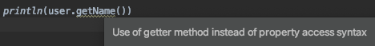

## Ejemplo 1: Clases Java en Kotlin

### OBJETIVO

- Demostrar la capacidad de interoperabilidad entre clases Java para Kotlin
- Utilizar los getters/setters de una clase Java como propiedades en Kotlin
- Experimentar las limitaciones de la comunicación entre estos

#### REQUISITOS

1. Saber utilizar clases Java
2. (Opcional) Tener un ligero conocimiento de programación con Java

#### DESARROLLO

Kotlin puede utilizar clases Java con tan solo pequeños detalles en su compatibilidad.
Una prueba de esto es el siguiente código:

```kotlin
import java.util.Date
import java.text.SimpleDateFormat

fun main(){
   val now = Date()
   val formatDate = SimpleDateFormat("E yyyy.MM.dd 'at' hh:mm:ss a zzz")
   println("Fecha actual:  ${formatDate.format(now)}")
}

```
Como vemos, tanto la clase ***Date*** como ***SimpleDateFormat*** son clases pertenecientes a dos paquetes de Java.


Vamos a probar ahora con una clase Java elaborada por nosotros mismos. Crearemos para esto un POJO (Plain Old Java Object) Con sus propiedades, que serán privadas para que la manipulación corra a cargo de los setters y getters:

```java
public class User {
    private String name;
    private String lastName;
    private int age;
    private String status;
    private boolean male;
...
}
```

Declaramos el constructor dentro de la clase (Así es la sintaxis de Java). Este constructor recibe todos los argumento para poder asignárselos a sus propiedades:

```java
public User(String name,String lastName,int age, String status,boolean male) {
        this.name = name;
        this.lastName = lastName;
        this.age = age;
        this.status = status;
        this.male = male;
    }
```

declaramos después los getters y setters para el nombre:

```java
public String getName() {
        return name;
    }

public void setName(String name) {
        this.name = name;
    }
```

para lastName, declaramos solamente un getter:

```java
public String getLastName(){
        return lastName;
    }
```
para status, dejamos únicamente un setter:

```java
public void setStatus(String status){
        this.status = status;
    }   
```

Para age, crearemos un getter y un setter, pero sin seguir la convención de los nombres (el getter debería llamarse getAge) :

```java
public int getUserAge(){
        return age;
    }

    public void setAge(int age){
        this.age = age;
    }
```

Por último, para el atributo ***male*** seguiremos la convención de un getter para un valor booleano, o sea:

```java
public boolean isMale(){
        return male;
    }

    public void setMale(boolean male){
        this.male = male;
    }
```

Ahora que tenemos la clase Java armada, la instanciamos desde la función *main* de nuestro archivo principal Kotlin:

```kotlin
val user = User(
        "Pedro",
        "Navaja",
        38,
        "Casado",
        true
    )
```

Ahora utilizamos el getter de **name** para imprimir nuestro nombre

```kotlin
println(user.getName())
```

el código corre exitosamente, sin embargo, nos despliega una advertencia:



Segun los lineamentos de Kotlin, podremos usar los getters y setters de una clase en Java como propiedades si obedecen a la convención de getters y setters. Cambiamos entonces la forma a propiedad para el getter y setter:

```kotlin
 // getter y setter de name
    println(user.name)
    user.name = "Rebeca"
```

para ***lastName***, sólo tenemos el getter

```kotlin
//getters de lastName (no tiene setter)
    println(user.lastName)
```
al querer asignar un valor a esta propiedad, obtenemos el siguiente error:


***status*** no tiene getter, solo setter, así que correremos la siguiente línea:

```kotlin
user.status = "soltero"
```

Esta línea nos da el siguiente error:


Esto se debe a que Kotlin no soporta el formato propiedad para atributos que solo posean un setter, por lo que tendremos qué usar su forma de método:

```kotlin
//setter de status (no tiene getter)
    user.setStatus("Soltero")
```

Para ***age***, el getter no se llama *getAge* sino *getUserAge*. Por lo tanto, el sistema interpreta que la variable se llama *userAge* y que solo tiene getter. Para el setter, sucede algo similar al ejemplo anterior: al suponer que solo existe un setter, este se puede llamar únicamente como método.

```kotlin
//getter y setter de edad
    println(user.userAge)
    user.setAge(33)
```

Para un booleano, la regla cambia: en vez del keyword ***get***, utilizamos ***is*** y el sistema interpreta que la variable se llama ***isMale*** en vez de *male*.

```kotlin
//getter y setter de propiedad male (que cambia a isMale por regla)
    println("El usuario es hombre? ${user.isMale}")
    user.isMale = false
```


