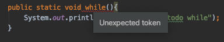

# Ejemplo 03 - Miembros estáticos y companion objects

## OBJETIVO

- Invocar miembros estáticos de clases de java en Kotlin
- Utilizar companion objects de kotlin en Java

## REQUISITOS

1. Saber el concepto de miembros estáticos en Java
2. Utilizar companion objects en kotlin

## DESARROLLO

El siguiente ejemplo requiere de la creación de varios archivos, que en este caso dejaremos en la misam raíz.

### Funciones estáticas

En java, existe un modificador llamado ***static*** que tiene la capacidad de fijar un miembro de la clase, pudiéendo hacer referencia a ella sin necesidad de crear un nuevo objeto. En kotlin, el equivalente es el companion object, visto en el [Ejmplo 3](../../Sesion-04/Ejemplo-03) de las sesión 4, porque puede retener directamente los valores sin instanciarlos.

En el siguiente código, implementamos un método y un atributo estático. En Java, basta hacer la referencia al miembro dentro de la clase para ser utilizado. Debemos crear la clase en un archivo *Product.java*

```java
public class Product {
    public static int stock = 20;

    public static void removeArticle(){
        stock--;
        System.out.println("Artículo removido, restantes: " + stock);
    }
}
```

Kotlin imita a la perfección el uso de los statics en Java, por lo que llamar al método *removeArticle* funcionaría bien en Kotlin. Vamos a crear un nuevo archivo *main.kt*

```kotlin
fun main(){
    //Llamando a miembros estáticos de la clase hecha en Java
    Product.removeArticle()
}
```

### Identificadores java y keywords kotlin

Podría presentarse el caso en el que algún identificador del miembro de una clase creada en Java lleve el mismo nombre que un *keyword* en kotlin, es por eso que para estos casos, se usan los backticks  de forma que se puedan usar los miembros en kotlin sin tener un error.

Vamos a declarar una clase ***Keywords*** con muchos métodos con identificadores que son keywords en kotlin. Los métodos pueden ser estáticos para simplificar su uso. 

```java
public class Keywords {

    public static void is(){
        System.out.println("Corriendo el método is");
    }

    public static void val(){
        System.out.println("Corriendo el método val");
    }

    public static void fun(){
        System.out.println("Corriendo el método lateinit");
    }

}
```

para esto, si utilizamos un identificador que se use como keyword en Java, obtenemos el siguiente erorr:

 

Esto se debe a que el identificador while ya es un keyword en Java.


Ahora, para probar que no exista ningún detalle, corremos en nuestro *main* de kotlin el método estático *fun*. Observamos el siguiente error:

 

es por eso que se utilizan los backticks. Si utilizamos el autocompletamiento para estos métodos, los backticks rodeandes se agregan automáticamente:

```kotlin
Keywords.`fun`()
```

De forma similar, corremos los otros dos métodos 

```kotlin
Keywords.`val`()
Keywords.`is`()
```

### Companion Objects y Java

Similar a las funciones estáticas, Java puede reconocer los companion objects. Como ejemplo, utilizamos la clase ***RandomGenerator*** en su respectivo archivo:

```kotlin
class RandomGenerator{
    companion object {

        fun generate(): Int {
            return (0..10).random()
        }

        val initialPhrase = "Hola a todos"
    }
}
```

Para correrlo en Java, creamos el archivo Main.java y dentro de su función estática main ejecutamos el código:

```java
public class Main {
    public static void main(String args[]){
        int randomNum = RandomGenerator.Companion.generate();

        System.out.println(randomNum);
        System.out.println(RandomGenerator.Companion.getInitialPhrase());
    }
}
```

Para llamar al método ***generate()***, tenemos que llamar a un objeto intermedio *Companion* , y en el caso de nuestro atributo ***initialPhrase***, llamamos a su getter.

Podemos evitar el código verborrágico para obtener el valor de ***initialPhrase*** mediante la anotación ***@JvmField*** en el archivo de kotlin:

```kotlin
...
@JvmField
val initialPhrase = "Hola a todos"
```

y se manda a llamar en Java como: 

```java
System.out.println(RandomGenerator.initialPhrase);
```


</br>

[Siguiente](../Reto-02)