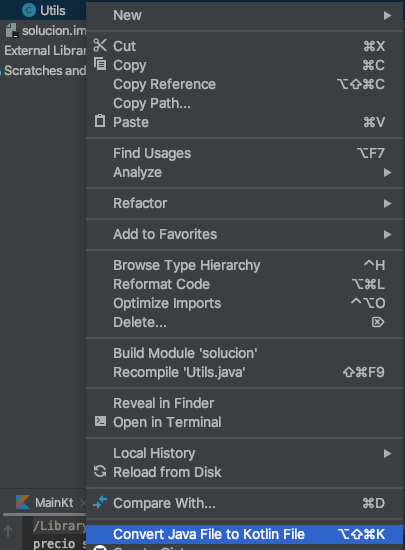

# Postwork

## OBJETIVO 

- Utilizar recursos provistos en lenguaje Java
- Aprovechar características como miembros estáticos 

## REQUISITOS 

1. Conocimiento básico de lenguaje Java


## DESARROLLO


### Utilizando J2K

IntelliJ Idea viene equipado con una herramienta bastante útil e interesante : J2K (Java to Kotlin ) Que permite convertir un archivo Java a Kotlin. Vamos a aprender a utilizarlo.

Supongamos que tenemos la siguiente clase *Utils* de un proyecto anterior en Java que nos va a servir para este nuevo proyecto, dentor de la clase, tenemos un método que nos va a servir para darle formato a las cantidades de dinero, tenemos algo así:

```java
public class Utils {
    public static String FormatPrice(Float price) {
        NumberFormat currencyInstance = NumberFormat.getCurrencyInstance();
        currencyInstance.setCurrency(Currency.getInstance("MXN"));
        return currencyInstance.format(price);
    }
}
```

Podemos utilizar este código tal cual está. En el [Reto final](../Reto-final), tenemos un proyecto solución al reto final que podemos emplear aquí para ejemplificar. Pondremos aquí el resultado como **Example** .

Utilizamos nuestra clase Utils para darle formato a los precios en nuestro *main*:

```kotlin
println("precio sin impuesto: ${ Utils.formatPrice(iPhone.price) }")
println("precio con impuesto: ${Utils.formatPrice(iPhone.priceWithTax())}")
```

y funciona! ahora vamos a convertir Utils a Kotlin:



Convertir de Java a kotlin puede traer errores, por lo que nos advierten con este diálogo


Finalmente nuestro código quedó así:

```kotlin
object Utils {
    fun formatPrice(price: Float?): String {
        val currencyInstance = NumberFormat.getCurrencyInstance()
        currencyInstance.currency = Currency.getInstance("MXN")
        return currencyInstance.format(price)
    }
}

```

Como tal, no es totalmente una equivalencia, pero si ejecutamos de nuevo el *main*, funciona! En casos como clases simples, la conversión puede ser más fiel. Inténtalo convirtiendo la clase SmartPhone a Kotlin!!


### Paquetes Java

gran parte de la interoperabilidad entre estos dos lenguajes se encuentra en el uso de paquetes de java en kotlin, puesto que proporciona muchas herramientas útiles que quizá kotlin aun no implementa como nativa. 

algunos ejemplos son:

* java.util
* java.text
* java.io

### Integración al proyecto

Busca implementar nuevas funcionalidades a tus clases, como dar formato a fechas, dinero y tiempo; o quizá generar números aleatorios. Prueba buscando soluciones en internet a estas funcionalidades pero en lenguaje Java, y después integrándolo a tu proyecto. Esto es algo útil en el desarrollo de apps porque tanto en documentación de librerías como muchas de las soluciones a problemas (incluyendo stackoverflow) siguen presentándose en Java.


</br>

[Regresar](../)