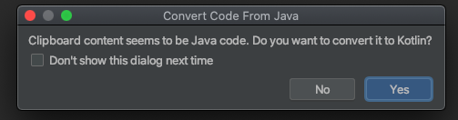

# Reto final

## OBJETIVO 

- Utilizar recursos provistos en lenguaje Java
- Aprovechar características como miembros estáticos 

## REQUISITOS 

1. Conocimiento básico de lenguaje Java
2. Dominio de tema de clases e interfaces

## DESARROLLO

### Traducir código Java a Kotlin

Existen muchos recursos que Java proporciona desde sus paquetes, o bien, snippets que encontramos en internet que pueden ser de ayuda en nuestro proyecto.

Es muy común que, en desarrollo para android, encontremos muchas soluciones a problemas codificados en Java, por lo que un truco bastante útil es copiar ese código Java en tu archivo Kotlin; al hacer esto, Nuestro IDE  IntelliJ idea puede hacer una traducción bastante atinada que quizá no requiera corrección alguna, intenta hacerlo con el siguiente pedazo de código:

```java
Date now = new Date( );
SimpleDateFormat formatDate =
new SimpleDateFormat ("E yyyy.MM.dd 'at' hh:mm:ss a zzz");

System.out.println("Fecha actual: " + formatDate.format(now));
```

Al copiarlo al archivo kotlin en nuestra IDE, saldrá el siguiente mensaje (a menos de haber marcado el dialog box *Don't show this dialog next time* anteriormente):



Al aceptar, nuestro código se transformará a lo siguiente:

```kotlin
val now = Date()
val formatDate = SimpleDateFormat("E yyyy.MM.dd 'at' hh:mm:ss a zzz")
println("Fecha actual: " + formatDate.format(now))
```

Ya solo queda importar estos dos paquetes para que este bloque de código corra sin ningún problema

```kotlin
import java.text.SimpleDateFormat
import java.util.*
```

### Un repaso a los temas anteriores

En el [Reto anterior](../Reto-02) creamos una clase *SmartPhone*, la reutilizaremos con unas modificaciones

```java
public class SmartPhone {

    private float price;
    private String name;
    private String model;
    private String processor;

    protected static int stock;

    public static void restock(int newStock){
        stock += newStock;
    }

    public static void minusStock(){
        stock--;
    }

    public static int getStock(){
        return stock;
    }


    public SmartPhone(float price,String name, String model, String processor){
        this.price = price;
        this.name = name;
        this.model = model;
        this.processor = processor;
    }

    public float getPrice(){
        return price;
    }

    public String getName(){
        return name;
    }
    public String getModel(){
        return model;
    }
    
}
```

y agregaremos la siguiente interfaz en java, que permite obtener el precio con impuestos a un producto

```java
public interface Taxable {
    float priceWithTax();
}

```

1. El primer reto, es crear una clase IPhone que herede de SmartPhone y que implemente la interfaz *Taxable*

    <Details>
        <Summary>Solución</Summary>
        
    ```kotlin
    class IPhone : SmartPhone(21230.53F,
                            "iPhone",
                            "11 Pro",
                        "A13 Bionic"), Taxable {

        init {
            stock = 20
        }

        override fun priceWithTax(): Float {
            return price * 1.16f
        }

    }	
    ```

    </Details>

    </br>

2. Ahora creemos un nuevo iphone e imprimamos el precio sin y con impuestos


    <Details>
        <Summary>Solución</Summary>
        
    ```kotlin
    val iPhone = IPhone()

        println("precio sin impuesto: ${iPhone.price}")
        println("precio con impuesto: ${iPhone.priceWithTax()}")	
    ```

    </Details>

    </br>

### Implementación al proyecto

Ahora como reto para tu proyecto final, tu siguiente reto será transformar alguna clase que hayas creado y transcribirla a código Java, y reutilizarla en Kotlin!


</br>

[Siguiente](../Postwork)

