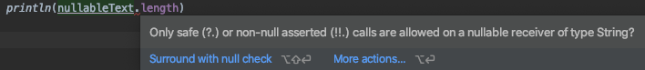

## Ejemplo 1: Null safety - Kotlin Fundamentals

### OBJETIVO

- Analizar cómo Kotlin evita las excepciones de tipos nulos.
- Implementar soluciones con tipos nullables.

### REQUISITOS

1. Conocimiento previo de tipos de datos y excepciones.

### DESARROLLO

Una de las dificultades más comunes en muchos lenguajes de programación, incluido Java, es que al acceder a un miembro de una referencia nula, dará como resultado una excepción de apuntador nulo, esto se refiere a que la . En Java, esto sería el equivalente de a NullPointerException NPE para abreviar.

En Kotlin, el sistema de tipos distingue entre referencias que pueden contener nulo (referencias anulables) y aquellas que no pueden (referencias no nulas). Por ejemplo, una variable de tipo regular String no puede contener nulo :

```kotlin
    val text: String = "String no nullable"

    //No se puede asugnar null a "a"
    text = null // error de compilacion
```

Para que el tipo de dato permita un valor nulo, debemos utilizar el operador *?* después del nombre del tipo:

```kotlin
     var nullableText: String? = "Este texto podría ser nulo"
     nullableText = null
    println(nullableText)
```
la función ***println*** tiene la capacidad de valores nulos.


Ahora bien, si ya tenemos una variable declarada como nullable ya no podemos hacer la llamada a sus métodos de forma directa como si de una variable no nullable se tratara:

```kotlin
    // generara un error argumentando que la variable en cuestion puede ser nula
    println(nullableText.length)
```

Para solucionar esto existen varias formas de trabajar con nullables:

#### Comprobacion de nulos en condiciones

De esta forma podemos verificar si una variable es nula o no:

```kotlin
    if (nullableText != null && nullableText.length > 0) {
        println("nullableText tiene ${nullableText.length} caracteres.")
    } else {
        println("nullableText esta vacio")
    }
```

Podemos observar que en la condición, primero verificamos que la variable contenga algo distinto de null y que contenga almenos un caracter. Si esto se cumple podemos acceder directamente a sus propiedades y métodos, de lo contrario ya sabemos que sí está vacía la variable.

#### Llamadas seguras (Safe Calls)

Otra opción son las llamadas Safe calls o llamadas seguras, estas las hacemos usando el operador **?**

Recordamos el codigo anterior:

```kotlin
    // generara un error argumentando que la variable en cuestion puede ser nula
    println(nullableText.length)
```
y genera el siguiente error de sintaxis:




En el ejemplo anterior, para acceder a propiedades o métodos de nuestra variable, utilizamos el operador **?**, lo que sucede a continuación es que si nullableText no está vacia (no es nula), entonces va a imprimir el valor que conrresponde a lu propiedad length, de lo contrario veremos una impresión en consola como "null".
```kotlin
    val nullableText2: String? = null
    ...
    println(nullableText2?.length)
```

#### Operador Elvis

Cuando tenemos una variable nullable, como vimos al principio, podemos saber si contiene o no algo por medio de condiciones, si recordamos que en kotlin no existe un operador ternario, y en su lugar podemos usar if como expresión, el primer ejemplo podríamos escribirlo tambien de esta forma: 

```kotlin
    val nullableText3: String? = null
    val resultadoSinElvis = if (nullableText3 != null) nullableText3 else "Texto vacío"
```

El operador Elvis **?:** hace que lo anterior sea mucho mas sencillo, usándolo podríamos escribir el mismo ejemplo de la siguiente manera:

```kotlin
    val resultadoConElvis = nullableText ?: "Texto vacío"
    println(resultadoConElvis)
```

**?:** se encarga de calcular si el nullable es nulo o no, si lo es, entonces retorna el valor de la derecha, de lo contrario el valor original de la izquierda.

En el [Reto 01](/../../tree/master/Sesion-07/Reto-01/) podras poner en práctica este tema !Éxito¡
