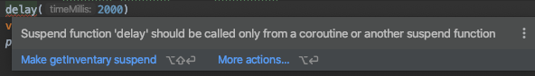

# Ej. 03 - Suspend functions y Jobs

## OBJETIVO

- Suspender la tarea de una corrutina hasta terminar de ejecutar otro proceso.
- Identificar la diferencia entre suspender y parar
- Parar corrutinas mediante un método
- Paralelizar dos corrutinas para que un Scope espere a la finalización de las dos

## REQUISITOS

1. Haber sintetizado el concepto de corrutinas
2. Saber utilizar scopes y diferenciarlos del Global Scope

## DESARROLLO

### Suspend functions

Una ***suspend function*** , es aquella función que puede suspender una corrutina mientras ejecuta su tarea. Bajo esta definición, ***delay()*** es una suspend function.

Simularemos una función que busca un producto mediante su id, después de un momento de espera, devuelve la cantidad en stock de un producto. Los procesos se marcan por una impresión en pantalla.

```kotlin
fun getInventary(productId:Int):Int{
    println("Buscando producto en el inventario...")
    delay(2000)
    val stock = (0..99).random()
    println("producto identificado, en stock: $stock")
}
```

La IDE nos advierte del siguiente error:



Para que nuestra función sea suspendida, debemos etiquetarla con el *keyword* ***suspend***

```kotlin
suspend fun getInventary(productId:Int):Int{
...
```

Ejecutamos desde main:
```kotlin
fun main(){
    GlobalScope.launch {
        getInventary(1)
    }
}
```

Qué sucede? como el thread principal lanza la corrutina e inmediatamente termina, la corrutina nunca termina el tiempo de busqueda y se cancela. Para poder imprimir pararemos unos segundos el hilo principal.

```kotlin
Thread.sleep(4000)
```

y da un resultado similar a esto: 

> Buscando producto en el inventario...

> producto identificado, en stock: 9

Bien, para simplificarnos el trabajo, podríamos volver coroutine a nuestra función *main* utilizando el constructor *runBlocking*.

```kotlin
fun main() = runBlocking { // this: CoroutineScope
    getInventary(1)
}
```

### Jobs

Cuando lanzamos una coroutine, un objeto Job hace referencia a esta. Por medio de esta referencia, podemos invocar distintos métodos y atributos de este, por ejemplo:

* Join() : Suspende al hilo que hace la llamada a esta función hasta que la coroutine a la que se asocia el Job finalice su ejecución.
* cancel(): Cancela la ejecución de la coroutine, junto con los otros Job incluidos en el scope.
* isActive
* isCancelled
* isCompleted

corremos el siguiente código:

```kotlin
fun main() = runBlocking {
    val job = GlobalScope.launch {
        delay(1000L)
        println("Mundo!")
    }
    println("Hola")
}
```
Al parecer el código busca imprimir "Hola", esperar un segundo de la corrutina e imprimir "Mundo!". El resultado real imprime solo "Hola". Esto se debe a que Job no esta en el mismo scope que la función main, porque se definió en la global scope. El método ***join()*** de nuestra referencia **job** va a forzar una suspensión hasta que la corrutina finalice:

```kotlin
fun main() = runBlocking {
    val job = GlobalScope.launch 
       ...
    job.join()
}
```

una alternativa sería lanzar la corrutina como parte del scope que crea **runBlocking**

```kotlin
fun main() = runBlocking {
    launch { 
        delay(1000L)
        println("Mundo!")
    }
    println("Hola")
}
```

Ahora, para cancelar un *job* basta con ejecutar la función mencionada anteriormente.

Supongamos que una corrutina se encarga de hacer el pago de un producto en línea


```kotlin
val buyJob = launch(Dispatchers.Default) {
    var percentage = 0

    while (percentage<100){
        println("procesando pago: $percentage%")
        delay(500)
        percentage+=10
    }
    println("Pago exitoso!")
}
```

Si queremos cancelar, esperamos un poco para ver algo de la carga y utilizamos el método ***cancel()***

```kotlin
delay(2000)
buyJob.cancel()
```


</br>

[Siguiente](../Reto-02)
