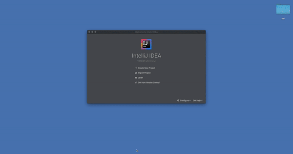
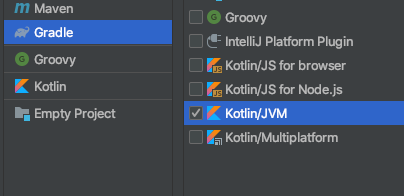
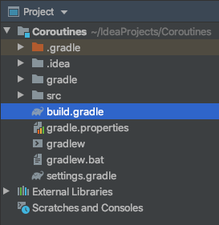
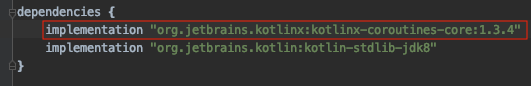
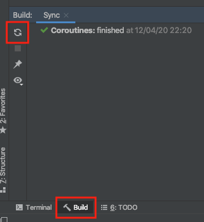
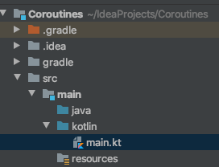

# Sesión 08: Programacion Asíncrona

## :dart: Objetivos

- Definir las bases de la programación asíncrona 
- Determinar las herramientas que nos provee el lenguaje para ejecutar procesos de forma paralela 
- crear flujos asíncronos.

## ⚙ Requisitos

**Instalación de dependencia**

En este módulo, requerimos instalar la dependencia ***kotlinx.coroutines*** en nuestro proyecto, esto lo haremos con ayuda de *gradle*, un sistema de automatización de construcción que entre otras cosas, permite una instalación fácil de paquetes.

El setup inicial para cada proyecto dentro de este módulo se resume en el siguiente gif:




*****Paso 1*****
---
Crea un nuevo proyecto desde IntelliJ Idea


*****Paso 2*****
---
En la barra lateral izquierda de la configuración del nuevo proyecto, elegir ***gradle*** con el framework ***Kotlin/JVM***



*****Paso 3*****
---
Elegir el nombre del proyecto

*****Paso 4*****
---
Cuando el proyecto se haya creado, abrir el archivo ***build.gradle*** ubicado en la raíz del proyecto.



*****Paso 5*****
---
Dentro del archivo abierto, localizar ***dependencies*** e insertar la implementación del paquete de corrutinas, con la siguiente línea:

```kotlin
implementation "org.jetbrains.kotlinx:kotlinx-coroutines-core:1.3.4"
```



*****Paso 6*****
---
Sincronizar gradle, en el botón de refresh al seleccionar la pestaña *build* en la parte inferior de la IDE.




*****Paso 7*****
---
Crear el archivo ***Main.kt*** dentro de la ruta ***src/main/kotlin***




#### Código de prueba

Para verificar que la configuración anterior fue exitosa, podemos ingresar en ***main.kt*** el siguiente código:

```kotlin
import kotlinx.coroutines.GlobalScope
import kotlinx.coroutines.delay
import kotlinx.coroutines.launch

fun main(){

    println("Inicio del programa")

    // Inicio de la corrutina
    GlobalScope.launch {
        delay(1000)
        println("Delay de un segundo")
    }

    Thread.sleep(3000) // Esperar dos segundos
    println("Terminando programa")
}
```

Al correr debe dar un resultado como este, con sus respectivas pausas ( El código es explicado en el [Ejemplo 1](./Ejemplo-01) )

## 📂 Organización de la clase

- [Ejemplo 01: Introducción a las coroutines](Ejemplo-01)
	- [Reto 01](Reto-01)
		
- [Ejemplo 02: Threads vs Coroutines](Ejemplo-02)
		
- [Ejemplo 03: Suspend functions yJobs](Ejemplo-03)
	- [Reto 02](Reto-02)

- [Reto final](Reto-final)

- [Postwork](Postwork)


